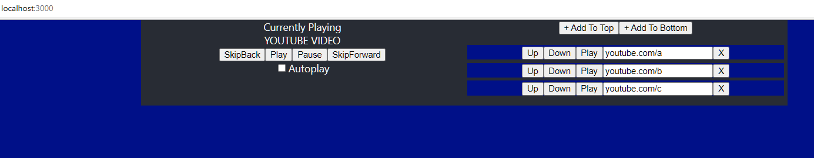
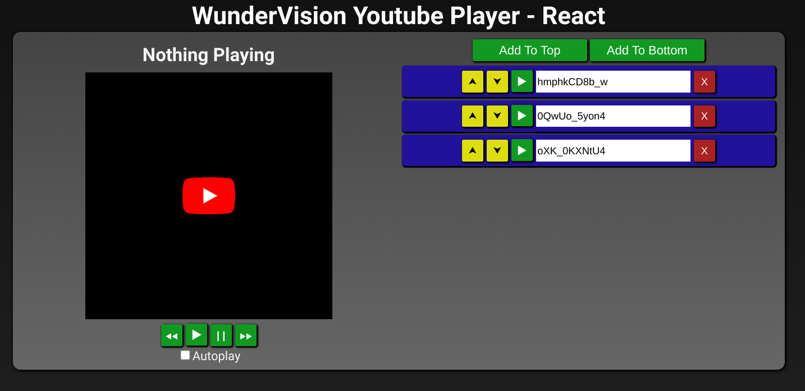
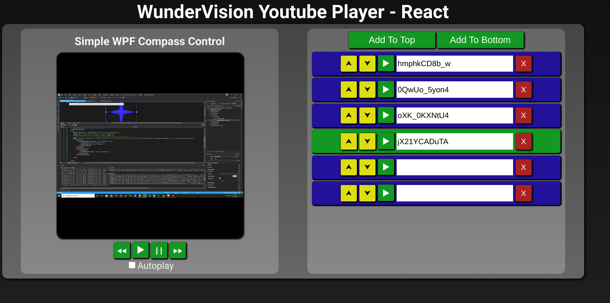

## Introduction

- [Live Demo](/demos/react-youtube-playlist)
- [Source Code](https://github.com/Corey255A1/YoutubePlaylist-React)
- [Youtube Playlist Project Post](/posts/2023-02-09-youtube_playlist_project/)

When I started this, I had not built anything from the ground up using React. I have been reading a lot of tutorials on it. I am also currently going through a Udemy course on it. I like to just dig in and see what I can figure out on my own.
I find that learning how to formulate the right questions about a topic helps me learn things faster.


React is all about creating components. Looking at our design mock up, we can kind of see what our components should be. This idea should really be applied to all UI design in my opinion, not just React. 
 
As I'm building this, I'm thinking there has to be a better way to bubble up our custom events from nested components. I started by initially passing down several layers of callbacks in the props. This doesn't seem very efficient or robust, but this is good enough to continue progress. The base PlayListItem calls some callbacks which are listened to by the Playlist Component.. Which calls some callbacks up into the App which manages the array of items. 
 
I've also read some things about useState. However, when using Typescript and classes, you can't use useState. Using the setState is not too bad, however useState does look a lot cleaner.
 
Any time the URL changes of an element, the whole array has to update. However, it seems like React is smart enough to not have to recreate all of the other elements that didn't change. It does this using the key property on the components in the list. Continuously making new arrays could be an issue if there were a lot of elements. For now, though it seems efficient enough with the small amount of items. I'm still looking for the best practice on what I'm trying to accomplish here.

<p class="blog-img center lg">
    
    <div class="center">Initial Layout</div>
</p>

## Youtube IFrame API
To start off, I just copied in the embeddable Iframe from a Youtube video. It seems that the Iframe in React expects a couple of the attributes to be camel cased allowFullScreen and frameBorder. 
 
When using the API in TypeScript, to satisfy the compiler I added a global declare for the YT on Window. I also had to create an interface to define the Player inside the YT namespace.

The API allows you to give it the ID of a div to replace with an iframe. I opted to just use an iframe from the beginning. That way I don't have to mess around with weird React stuff to get the new iframe.
 
After getting the API successfully readying up, I noticed something weird. The render call is being called twice. I thought I was doing something wrong somewhere so I started adding some console logs and searching. I found out that if the <React.StrictMode> is wrapped around the <App> it intentionally calls Render twice. It does this to help catch bugs. Which in this case it is. My issue was that calling render back to back like that, the youtube API hasn't loaded yet and so it loads it again. I got around that problem by adding some static flags and functions to track if it was already called, and also a queue to handle and videos that are waiting for it to load. 
 
My next issue with the Youtube API was that on Chrome/Edge for some reason when I click play the player goes "Unstarted", "Buffering", and then back to "Unstarted". It seems to work OK on Firefox. The reason for this is because the Chrome/Edge policy does not allow videos to play with sound if a user has not interacted with the webpage first. Which makes sense, because who wants annoying popups blasting sound? However, it's a little different because clicking play my play button should count as user interaction, but I think because the Youtube video is in an IFrame that it doesn't count.

For the video player to work with my own buttons, the video has to be defaulted to muted. There is no way to programmatically unmute the video (which also makes sense). This means for the videos to have sound, the user will have to unmute it manually.

Oh well...

The next thing I ran into was how to mute the video. Using the **playerVars: {'mute':1}** when creating the new YT.Player was not working for me. The only thing that worked was adding **&mute=1** to the initial iframe url.

<div style="background: #ffffff; overflow:auto;width:auto;border:solid gray;border-width:.1em .1em .1em .8em;padding:.2em .6em;"><pre style="margin: 0; line-height: 125%"><span style="color: #007700">&lt;iframe</span> 
    <span style="color: #0000CC">width=</span><span style="background-color: #fff0f0">{this._width}</span> 
    <span style="color: #0000CC">height=</span><span style="background-color: #fff0f0">{this._height}</span> 
    <span style="color: #0000CC">src=</span><span style="background-color: #fff0f0">&quot;http://www.youtube.com/embed/B-w86z_gbP8?enablejsapi=1&amp;mute=1&quot;</span> 
    <span style="color: #0000CC">title=</span><span style="background-color: #fff0f0">&quot;YouTube video player&quot;</span> 
    <span style="color: #0000CC">frameBorder=</span><span style="background-color: #fff0f0">&quot;0&quot;</span> 
    <span style="color: #0000CC">allow=</span><span style="background-color: #fff0f0">&quot;accelerometer; autoplay; clipboard-write; encrypted-media; gyroscope; picture-in-picture; web-share&quot;</span> 
    <span style="color: #0000CC">allowFullScreen</span> 
    <span style="color: #0000CC">id=</span><span style="background-color: #fff0f0">{this._id}</span> 
<span style="color: #007700">&gt;&lt;/iframe&gt;</span> 
</pre></div>


Once I finally got that working. I went ahead and connected up the play, pause and loadVideoById. I was able to do those actions and prove that my idea was going to work. 
I changed a how I was initially going to pass back the controller for the good. 
 
I made an interface:  
<div style="background: #ffffff; overflow:auto;width:auto;border:solid gray;border-width:.1em .1em .1em .8em;padding:.2em .6em;"><pre style="margin: 0; line-height: 125%"><span style="color: #008800; font-weight: bold">export</span> <span style="color: #008800; font-weight: bold">interface</span> MediaPlayer{ 
	play<span style="color: #333333">:</span>()<span style="color: #333333">=&gt;</span><span style="color: #008800; font-weight: bold">void</span>; 
	pause<span style="color: #333333">:</span>()<span style="color: #333333">=&gt;</span><span style="color: #008800; font-weight: bold">void</span>; 
    loadVideoById<span style="color: #333333">:</span>(videoId:<span style="color: #333399; font-weight: bold">string</span>, startSeconds:<span style="color: #333399; font-weight: bold">number</span>)<span style="color: #333333">=&gt;</span><span style="color: #008800; font-weight: bold">void</span>; 
}
</pre></div>

Which the component implements, and the I pass that back up to the parent component through a prop function. 
 
this.props.setMediaPlayer(this); 
 
Which allows me to do this: 
 <div style="background: #ffffff; overflow:auto;width:auto;border:solid gray;border-width:.1em .1em .1em .8em;padding:.2em .6em;"><pre style="margin: 0; line-height: 125%"><span style="color: #007700">&lt;div&gt;</span> 
    <span style="color: #007700">&lt;YoutubePlayer</span> <span style="color: #0000CC">setMediaPlayer=</span><span style="background-color: #fff0f0">{this.setMediaPlayer.bind(this)}</span><span style="color: #007700">&gt;&lt;/YoutubePlayer&gt;</span> 
<span style="color: #007700">&lt;/div&gt;</span> 
<span style="color: #007700">&lt;div&gt;</span> 
    <span style="color: #007700">&lt;button</span> <span style="color: #0000CC">onClick=</span><span style="background-color: #fff0f0">{()=</span><span style="color: #007700">&gt;</span>{this._mediaPlayer?.loadVideoById(&quot;Qt0-9mO-ZXY&quot;,0)}}&gt;SkipBack<span style="color: #007700">&lt;/button&gt;</span> 
    <span style="color: #007700">&lt;button</span> <span style="color: #0000CC">onClick=</span><span style="background-color: #fff0f0">{()=</span><span style="color: #007700">&gt;</span>{this._mediaPlayer?.play()}}&gt;Play<span style="color: #007700">&lt;/button&gt;</span> 
    <span style="color: #007700">&lt;button</span> <span style="color: #0000CC">onClick=</span><span style="background-color: #fff0f0">{()=</span><span style="color: #007700">&gt;</span>{this._mediaPlayer?.pause()}}&gt;Pause<span style="color: #007700">&lt;/button&gt;</span> 
    <span style="color: #007700">&lt;button</span> <span style="color: #0000CC">onClick=</span><span style="background-color: #fff0f0">{()=</span><span style="color: #007700">&gt;</span>{this._mediaPlayer?.loadVideoById(&quot;viIQYswj1Rk&quot;,0)}}&gt;SkipForward<span style="color: #007700">&lt;/button&gt;</span> 
<span style="color: #007700">&lt;/div&gt;</span> 
 
</pre></div>


This all works great when the iframe is initialized with a URL. I tried a bunch of different things trying to not initialize the iframe with a url, when I discovered that just using the embedded url without an ID, works exactly how I wanted,

```html
src="http://www.youtube.com/embed?enablejsapi=1&mute=1" 
```
 
## Connecting up the player
Now the next task.. Getting the title of the loaded video and updating the title of the Now Playing title 

I was a little concerned about how the rerendering works.

I have the videoTitle of the component defined as a state that I update when the media player changes its state to Play. I was afraid that calling setState and forcing a render that my IFrame of the youtube player would get blown away. That doesn't seem to be the case. It seems like it does only update the part of the html that changed which is good to know and great news. 
 
The next thing to do is feed our player with the videos from our playlist! To do this the playback component has to trigger the playlist to move to the next or previous item. Use the URL/ID from that new item and load the video. I'm really curious what a seasoned react developer would do in this case, but I can see how I would do it right now given my current knowledge of the possibilities of react. 
**Possibilities:**
- Pass in a handle to the playlist controller and control it from the player 
    - I don't like the coupling 
- In the outer app get a reference to the player and control it from there 
    - Could get messy. 
    - Doing something like this for the YoutubePlayer 
        - Not really sure if this is the best 
- Have a prop for a callback on OnPlayerNext/Previous 
    - Have it return the id of the URL as part of the callback 
    - Register for it in the app and pass it in from there. 
    - This might work. 
 
What I did was from the PlaybackComponent, I have a callback that is invoked when the controls on the playback controller are invoked. I used an enum to set the possible playback controller events 

<div style="background: #ffffff; overflow:auto;width:auto;border:solid gray;border-width:.1em .1em .1em .8em;padding:.2em .6em;"><pre style="margin: 0; line-height: 125%"><span style="color: #008800; font-weight: bold">export</span> <span style="color: #008800; font-weight: bold">enum</span> PlaybackControllerEvent { 
    Paused <span style="color: #333333">=</span> <span style="color: #0000DD; font-weight: bold">0</span>, 
    Playing <span style="color: #333333">=</span> <span style="color: #0000DD; font-weight: bold">1</span>, 
    Next <span style="color: #333333">=</span> <span style="color: #0000DD; font-weight: bold">2</span>, 
    Previous <span style="color: #333333">=</span> <span style="color: #0000DD; font-weight: bold">3</span>, 
} 
 
<span style="color: #888888">// YouTube States </span>
<span style="color: #008800; font-weight: bold">export</span> <span style="color: #008800; font-weight: bold">enum</span> PlayerState { 
    Uninitialized <span style="color: #333333">=</span> <span style="color: #333333">-</span><span style="color: #0000DD; font-weight: bold">1</span>, 
    Ended <span style="color: #333333">=</span> <span style="color: #0000DD; font-weight: bold">0</span>, 
    Playing <span style="color: #333333">=</span> <span style="color: #0000DD; font-weight: bold">1</span>, 
    Paused <span style="color: #333333">=</span> <span style="color: #0000DD; font-weight: bold">2</span>, 
    Buffering <span style="color: #333333">=</span> <span style="color: #0000DD; font-weight: bold">3</span>, 
    Cued <span style="color: #333333">=</span> <span style="color: #0000DD; font-weight: bold">5</span> 
}
</pre></div>

The single PlaybackEvent calls a function in the App to move the playlist index. 

When the currentPlayingItem is changed, that is passed down in to the PlayerList component which toggles the state on the matching item to highlight it as active 

I was originally tracking both the index and the current item. however maintaining the index of the current playing is kind of a pain when the playlist is modified. So instead, I opted to just save the playing item, and look up its position in the array after each action.  

With this, I have almost all of the functionality working. The last piece of the puzzle is getting the autoplay working.  

This will work by calling a next once the youtube player indicates that it has ended. But only if the auto play check box is checked. I tied the autoplay checkbox checked to a state property called autoplay, and then I look at the onChange and set it to the value of checked. It is not driving any other graphical pieces at this point, so probably a normal class property would have been fine, but I like the practice 
 
<p class="blog-img center lg">
    
    <div class="center">Basic Styling</div>
</p>

## Finishing the Styling
While I was finishing off the styling, I appreciated the ability to split up the css files. However, I just learned how the classes and styles are applied globally by default. It's like all the styles are combined in to a big CSS file in the end, which makes sense. I learned there is also the option of the CSS Modules, however for now, I haven't had any issues, so I will just keep doing what I'm doing.

<p class="blog-img center lg">
    
    <div class="center">Final Styling</div>
</p>

And there we have it! A functional and presentable Youtube Playlist App, using React!