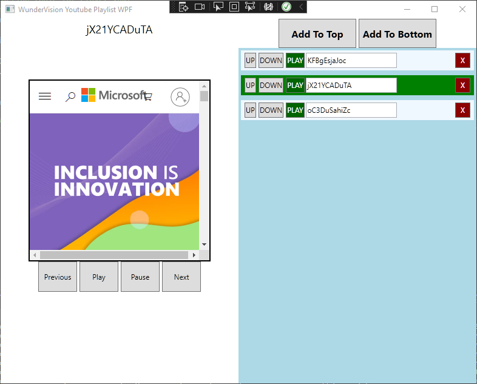
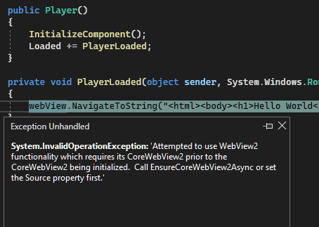
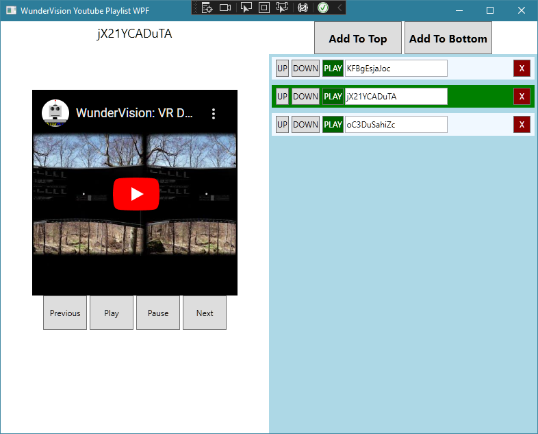
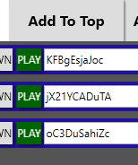
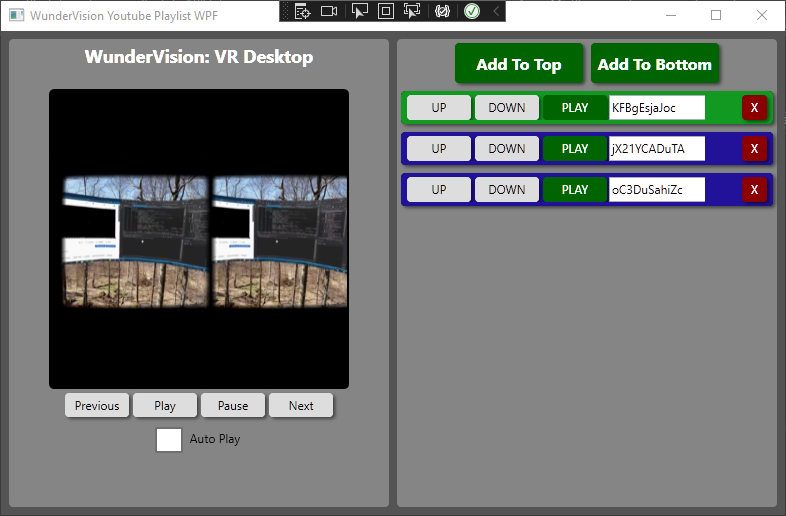
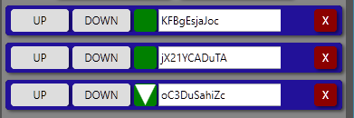
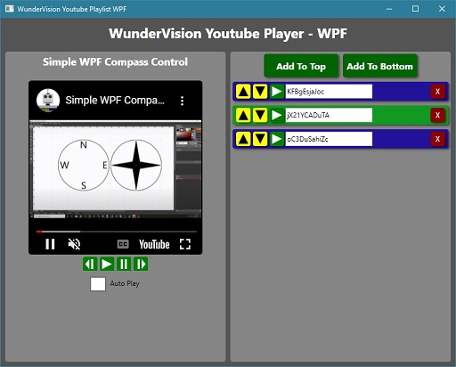

## Introduction

- [Source Code](https://github.com/Corey255A1/YoutubePlaylist-WPF)

One of the challenges of this project is going to be interacting with the WebView2. 
A big pattern idea of WPF is the separation of the Data and the View. This means minimizing the "code behind" that manually changes the actual elements of the interface. Data binding allows the GUI to handle changes to the data mostly automatically. Getting the binding to work just right is sometimes tricky. 
I'm going to have class that handles the storage of the playlist, and the currently playing items.

<div class="embed-youtube">
<iframe width="100%" height="100%" src="https://www.youtube.com/embed/gMWKvrkz-mQ" frameborder="0" allow="accelerometer; autoplay; clipboard-write; encrypted-media; gyroscope; picture-in-picture" allowfullscreen></iframe>
</div>

## Laying the ground work
In my typical fashion, I try to do things differently the next go around... for better or worse. I constantly seek the "best" way of doing something. In the software world though that is a constantly moving target. 
This go around I was exploring how to get the data context of my views set up without adding it to the code behind

```xml 
<Window.Resources> 
    <controllers:PlaylistController x:Key="playlistController"/> 
</Window.Resources> 
<Grid DataContext="{Binding Source={StaticResource playlistController}}"> 
```

The Playlist view should have a list of the playlist items. The ListView will be bound to the Controller Playlist Observable Collection 
Getting the WebView 2 to work required installing the Microsoft.Web.WebView2 Nuget package 
And in the XAML if the control

```xml
xmlns:wpf="clr-namespace:Microsoft.Web.WebView2.Wpf;assembly=Microsoft.Web.WebView2.Wpf" 

<wpf:WebView2 Grid.Row="2"></wpf:WebView2>
```


One thing that I've always found kind of surprising about WPF styling is how something that seemingly should be simple, turns into a whole bunch of code and research. For example, the ListView control. I wanted to just use a ListView for its easy of displaying list content. What I don't want is the mouse over highlighting and the item selection of it. To remove those from the ListView requires unstyling several different pieces of it. 
However, what I realized was that the better control to use is just the plain **ItemsControl**. It allows you to bind to the ItemsSource and provide the same ItemTemplate.

One thing I didn't want to do was add a value to the playlist item to maintain whether or not it is the active item. Therefore I needed to figure out how to highlight the active item using the information from the playlist controller. 
What seemed to be the cleanest was to use a MultiValue Converter to compare the selected item, with the item in the list

```C#
public class SelectedItemConverter : IMultiValueConverter 
{ 
    public object Convert(object[] values, Type targetType, object parameter, CultureInfo culture) 
    { 
        if (values[0] == values[1]) 
        { 
            return new SolidColorBrush(Colors.Green); 
        } 
        return new SolidColorBrush(Colors.AliceBlue); 
    } 
    public object[] ConvertBack(object value, Type[] targetTypes, object parameter, CultureInfo culture) 
    { 
        throw new NotImplementedException(); 
    } 
}
```

On the xaml side:

```xml
<Border.Background> 
    <MultiBinding Converter="{StaticResource selectedItemConverter}"> 
        <Binding Path="DataContext.CurrentPlaylistItem" RelativeSource="{RelativeSource AncestorType=ItemsControl}"/> 
        <Binding/> 
    </MultiBinding> 
</Border.Background>
```

The first element is binding to the Current Item of the playlist controller. The second item just binds the context of the item, which is the item itself. So in the converter it just returns a color based on whether or not the two items are the same. 
Using the ICommand to route the actions from the events. 
On the items in the list, I use the command parameter to pass in the item that the event was called from. Controller Specific commands use a different command that doesn't use a parameter; 
What's nice about the commands is that the GUI can invoke directly actions without requiring the code behind on the GUI itself. At this point, I don't have any code in directly in the controls. 
The functionality of the list and controller is almost connected up. 

## WebView2
Next up is to figure out what I need to do to get this WebView2 working with the youtube IFrame API. 
With the WebView I started with the basics.

```xml
<wpf:WebView2 DefaultBackgroundColor="Black"  
        Name="webView" 
        Source="https://www.microsoft.com"></wpf:WebView2>
```
What I tried to do next was call the NavigateToString method to navigate to a hardcoded webpage. 
I thought that calling that in the Loaded callback of the control would be good enough, but it was not.


**System.InvalidOperationException: 'Attempted to use WebView2 functionality which requires its CoreWebView2 prior to the CoreWebView2 being initialized.  Call EnsureCoreWebView2Async or set the Source property first.**

```C#
public Player() 
{ 
    InitializeComponent(); 
    Loaded += PlayerLoaded; 
} 
private async void PlayerLoaded(object sender, System.Windows.RoutedEventArgs e) 
{ 
    await webView.EnsureCoreWebView2Async(); 
    webView.NavigateToString("<html><head><style>html,body{background:lightgray;}</style><heaed><body><h1>Hello World</h1></body></html>"); 
} 
```

I have the basic Play and Pause functionality going with the YouTube IFrame. 



Executing code with in the WebView is extremely easy with:

```C# 
webView.ExecuteScriptAsync("play()"); 
```

Getting information back out of the WebView such as the play state or the title I thought was going to be tricky. However it was just a matter of connecting up a callback 
webView.CoreWebView2.WebMessageReceived += YoutubeWebviewWebMessageReceived; 
This is triggered when the javascript executes a postMessage:

```javascript
function playerStateChangeHandler(e) { 
    chrome.webview.postMessage(`${e.data}:${e.target.videoTitle}`); 
} 
```

On the C# side I have it kind of hacked at the moment. I might use the JSON parser to decode the json response. 

```C#
string[] response = e.WebMessageAsJson.Trim('"').Split(':', 2); 
YoutubeTitle = response[1]; 
```

Finally! With .NET 6 there is out of the box support for JSON! So I don't have to install the NewtonSoft JSON or use the DataContractSerializer for this project.

```C#
function playerStateChangeHandler(e) { 
    //Post the JSON object to the webview DON'T Stringify! 
    chrome.webview.postMessage({state:e.data, title:e.target.videoTitle}); 
}
```

There looks to be several ways to set up the deserialization object but I opted with the specify a class with the attributes

```C#
public enum YoutubePlayerState 
{ 
    Unstarted = -1, 
    Ended = 0, 
    Playing = 1, 
    Buffering = 3, 
    Paused = 2, 
    Queued = 5 
} 
public class YoutubeAPIStatus 
{ 
    [JsonPropertyName("title")] 
    public string Title { get; set; } = ""; 
    [JsonPropertyName("state")] 
    public YoutubePlayerState State { get; set; } 
}
```

Things are starting to come together, however the challenge now, is how to interface with the webview from our PlaylistController. 
What I wound up doing was creating a dependency property on the Player controller for a ICommand, and then bound to that command from the controller class.

```C# 
public ICommand PlayerStatusCommand { get; set; } 

PlayerStatusCommand = new YoutubePlayerStateCommand(PlayerStatusHandler); 

public void PlayerStatusHandler(YoutubeAPIStatus status) 
{ 
    Console.WriteLine(status.State.ToString()); 
} 
public ICommand YoutubePlayerStatusReceived 
{ 
    get { return (ICommand)GetValue(YoutubePlayerStatusReceivedProperty); } 
    set { SetValue(YoutubePlayerStatusReceivedProperty, value); } 
} 

public static readonly DependencyProperty YoutubePlayerStatusReceivedProperty = 
    DependencyProperty.Register("YoutubePlayerStatusReceived", typeof(ICommand), typeof(Player), new PropertyMetadata(null)); 
private void YoutubeWebviewWebMessageReceived(object? sender, CoreWebView2WebMessageReceivedEventArgs e) 
{ 
    YoutubeAPIStatus? status = System.Text.Json.JsonSerializer.Deserialize<Data.YoutubeAPIStatus>(e.WebMessageAsJson); 
    if(status == null) { return; } 
    YoutubeTitle = status.Title ?? "ERROR"; 
    YoutubePlayerStatusReceived?.Execute(status); 
} 
```

Actually now I can remove the Title property from the view and put that on the controller 
Next thing to tackle.. Getting the currently playing video to change. After thinking about this for a bit I think the cleanest solution is to make the YoutubeURL as dependency property on the player. 
You can add a callback for when that value changes

```C#
public string YoutubeVideoURL 
{ 
    get { return (string)GetValue(YoutubeVideoURLProperty); } 
    set { SetValue(YoutubeVideoURLProperty, value); } 
} 
public static readonly DependencyProperty YoutubeVideoURLProperty = 
    DependencyProperty.Register("YoutubeVideoURL", typeof(string), typeof(Player), new PropertyMetadata("",OnYoutubeVideoURLChanged)); 
private static void OnYoutubeVideoURLChanged(DependencyObject d, DependencyPropertyChangedEventArgs e) 
{ 
    ((Player)d).PlayVideo((string)e.NewValue); 
} 
private void PlayVideo(string id) 
{ 
    webView.ExecuteScriptAsync($"loadVideoById(\"{id}\",0)"); 
}
```

And then this can be bound to by the controller 
```xml
<views:Player Grid.Column="0"  
    WebViewHTMLPath="YoutubePlayer.html" 
    YoutubeVideoURL="{Binding CurrentPlaylistItem.URL}" 
    YoutubePlayerStatusReceived="{Binding PlayerStatusCommand}" />
```
This is working out nicely. The Player has no idea about the PlaylistController. 
The last thing to do is the auto play check box that I forgot. 
Sizing the checkbox part of the check box, seems like the easiest thing to do is add a ScaleTransform and increase the scale. The only thing is that if you were going to use the label part of the checkbox that also increases. What I did was just add a manual label next to the checkbox.

```xml
<StackPanel Grid.Row="4" HorizontalAlignment="Center" Orientation="Horizontal" Margin="4"> 
    <CheckBox VerticalContentAlignment="Top" IsChecked="{Binding AutoPlay}"> 
        <CheckBox.LayoutTransform> 
            <ScaleTransform ScaleX="2" ScaleY="2" /> 
        </CheckBox.LayoutTransform> 
    </CheckBox> 
    <Label HorizontalContentAlignment="Left" VerticalAlignment="Top" VerticalContentAlignment="Top">Auto Play</Label> 
</StackPanel>
```

Bind that to the AutoPlay boolean of the controller.. And that’s it! 
In the callback for the Status Event, I check if the AutoPlay is true and if the status is ended, and then PlayNextItem() 

```C#
public void PlayerStatusHandler(YoutubeAPIStatus status) 
{ 
    Title = status.Title; 
    PlayerState = status.State; 
    if(AutoPlay && PlayerState == YoutubePlayerState.Ended) { 
        PlayNextItem(); 
    } 
}
```

## Styling
Functionally, all the pieces are there!! Now time to clean up the look a little bit

I have  ran in to this problem before.. When you try to add a drop shadow to a button, it affects the contents of the button also. 
```xml
<Setter Property="BitmapEffect"> 
    <Setter.Value> 
        <DropShadowBitmapEffect Direction="320" Softness="0.2" ShadowDepth="3" Opacity="0.5" Color="Black"/> 
    </Setter.Value> 
</Setter>
```



To get around this, I added a second border that is behind the main button content, which a shadow

```xml
<Setter Property="Template"> 
    <Setter.Value> 
        <ControlTemplate TargetType="Button"> 
            <Grid> 
                <Border CornerRadius="8" Background="{TemplateBinding Background}"> 
                    <Border.BitmapEffect> 
                        <DropShadowBitmapEffect Direction="320" Softness="0.2" ShadowDepth="3" Opacity="0.5" Color="Black"/> 
                    </Border.BitmapEffect> 
                </Border> 
                <Border CornerRadius="8" Background="{TemplateBinding Background}" > 
                    <ContentPresenter x:Name="contentPresenter" ContentTemplate="{TemplateBinding ContentTemplate}" Content="{TemplateBinding Content}" HorizontalAlignment="{TemplateBinding HorizontalContentAlignment}" Margin="{TemplateBinding Padding}" VerticalAlignment="{TemplateBinding VerticalContentAlignment}"/> 
                </Border> 
            </Grid> 
        </ControlTemplate> 
    </Setter.Value> 
</Setter> 
```

I'm not going to crazy with the theming, so I put the resources in the App.xaml. This way I can reuse the styles in both controls easily. 
This is starting to look nice!



I wanted to add some icons to these buttons. The first one I started was the Play button. 
WPF allows you to create rectangle and polygons easily. 
However I tried the naïve approach to add the triangle to the button

```xml
<Style TargetType="Button" BasedOn="{StaticResource SquareButton}" x:Key="PlayButton"> 
    <Setter Property="Background" Value="Green"/> 
    <Setter Property="Foreground" Value="White"/> 
    <Setter Property="Content"> 
        <Setter.Value> 
            <Polygon Stretch="Uniform" Points="0,0 20,0 10,20" Fill="White"/> 
        </Setter.Value> 
    </Setter> 
</Style>
```



This confusingly resulted in only one of the buttons have an icon at a time. What I didn't realize was that setting the content this way in the style, results in only one polygon being created and the passed around between the buttons. 
Instead of setting the content, you have to set it in the Template 

```xml
<Setter Property="Template"> 
    <Setter.Value> 
        <ControlTemplate TargetType="Button"> 
            <Grid> 
                <Border CornerRadius="4" Background="{TemplateBinding Background}"> 
                    <Border.BitmapEffect> 
                        <DropShadowBitmapEffect Direction="320" Softness="0.2" ShadowDepth="3" Opacity="0.5" Color="Black"/> 
                    </Border.BitmapEffect> 
                </Border> 
                <Border CornerRadius="4" Background="{TemplateBinding Background}" > 
                    <Polygon Stretch="Uniform" Points="0,0 0,20 20,10" Fill="White" Margin="4"/> 
                </Border> 
            </Grid> 
        </ControlTemplate> 
    </Setter.Value> 
</Setter>
```

To get the Multi Polygon Buttons to render correctly, throw a ViewBox around a canvas

```xml
<Viewbox Margin="4"> 
    <Canvas HorizontalAlignment="Center" VerticalAlignment="Stretch" Width="20" Height="20"> 
        <Polygon Points="4,0 8,0 8,20 4,20" Fill="White"/> 
        <Polygon Points="16,0 12,0 12,20 16,20" Fill="white"/> 
    </Canvas> 
</Viewbox>
```

It's starting to look pretty good. However, during the styling I've lost the hover effect. 
To get that back in a basic way, you can use Style triggers. 

```xml
<Style.Triggers> 
    <Trigger Property="IsMouseOver" Value="True"> 
        <Setter Property="Background" Value="LightBlue"/> 
    </Trigger> 
    <Trigger Property="IsPressed" Value="True"> 
        <Setter Property="Background" Value="AliceBlue"/> 
    </Trigger> 
</Style.Triggers>
```



Now we have a basic, presentable looking Youtube Playlist App, using WPF! 