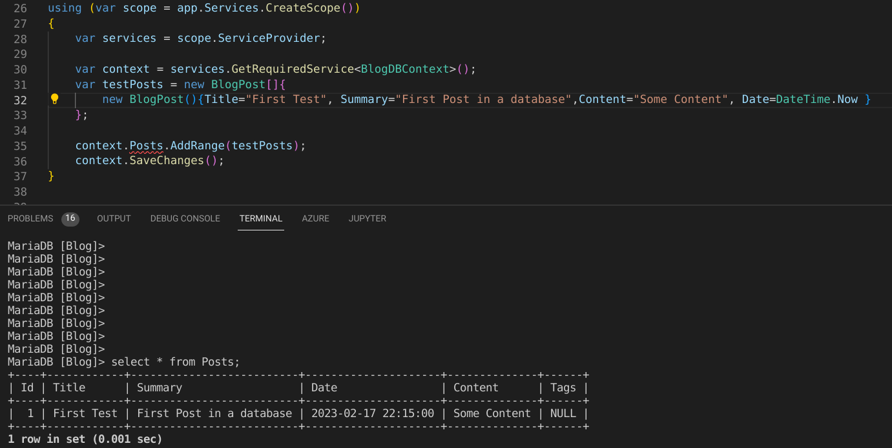
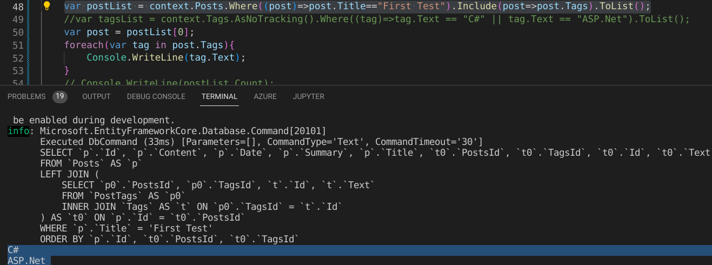

## Introduction
- [Source](https://github.com/Corey255A1/WunderVision-Blog-ASP.Net)

Even though I decide not to continue pursuing this as my blog solution, it was good deep dive into using ASP.Net, Razor Pages and EF Core. One of the on going confusing parts of learning ASP.Net is that, at least currently, thing have changed so fast that a lot of the blogs are using out dated or deprecated patterns. I tried to use the most up to date techniques. Additionally, a lot of the beginner tutorials start by running scaffolding code. This is great if you know what the scaffolding does. It is just too much magic for me so I opted to do it all from scratch. This post is about setting up the database connection.

### Helpful Links
- Documentation on using EF Core to make a blog
    - [https://learn.microsoft.com/en-us/ef/core/modeling/relationships?tabs=data-annotations%2Cfluent-api-simple-key%2Csimple-key](https://learn.microsoft.com/en-us/ef/core/modeling/relationships?tabs=data-annotations%2Cfluent-api-simple-key%2Csimple-key)
- Getting started with a basic Database Connection
    - [https://learn.microsoft.com/en-us/aspnet/core/data/ef-rp/intro?view=aspnetcore-8.0&tabs=visual-studio-code#update-the-database-context-class](https://learn.microsoft.com/en-us/aspnet/core/data/ef-rp/intro?view=aspnetcore-8.0&tabs=visual-studio-code#update-the-database-context-class)
- Information on how EF Core tracks changes.
    - [https://learn.microsoft.com/en-us/ef/core/change-tracking/](https://learn.microsoft.com/en-us/ef/core/change-tracking/)
- How to query Related Data 
    - [https://learn.microsoft.com/en-us/ef/core/querying/related-data/](https://learn.microsoft.com/en-us/ef/core/querying/related-data/)


## Database Connection
First thing to do is define the tables in the database. I know from reading that you can enable your project to do Code First Migrations, which means that the EF Core handles making sure that your database is set up to translate the classes into the correct tables. However, I just wanted to do it the hard way because I'm attempting to familiarize myself with SQL and using Databases as well.
I was using MariaDB for my local development database and MySQL on Azure. 
To use MariaDB you must install the **Pomelo** EF Core Nuget package.
  
*Notes*  
To create a user that has more than localhost access:
**'username'@'%'**  
The % means from any where  
MariaDB by default doesn't listen on all networks. To change that you have to modify the my.cnf  
I found the line in /etc/mysql/mariadb.conf.d/50-server.cnf  
**bind-address** is the line you are looking for.

```sql
create database Blog; 
use Blog; 

create table Posts(
    Id int NOT NULL AUTO_INCREMENT,
    Title VARCHAR(256),
    URL VARCHAR(256),
    ThumbnailURL VARCHAR(256),
    Summary VARCHAR(1024),
    Date TIMESTAMP,
    Content MEDIUMTEXT,
    CONSTRAINT PK_Post Primary Key (Id)
);

create table Tags(
    Id int NOT NULL AUTO_INCREMENT,
    Text VARCHAR(256),
    CONSTRAINT PK_Tag Primary Key (Id) 
); 

create table PostTags( 
    PostsId int, 
    TagsId int, 
    Constraint PK_PostTag Primary Key (PostsId, TagsId), 
    CONSTRAINT FK_PostTag_Posts_PostsId FOREIGN KEY (PostsId) 
    REFERENCES Posts (Id) ON DELETE CASCADE,  
    CONSTRAINT FK_PostTag_Tags_TagsId FOREIGN KEY (TagsId) 
    REFERENCES Tags (Id) ON DELETE CASCADE
); 
```

For the database connector I was specifying the server version based on if it was in development mode or not.

```C#
ServerVersion serverVersion;
if (!builder.Environment.IsDevelopment())
{
    serverVersion = new MySqlServerVersion(new Version(8,0));
} 
else 
{ 
    serverVersion = new MariaDbServerVersion(new Version(15,1));
} 
```


The next thing to do is define the classes to store the data. The **Table** annotation allows you to specify the name of the table as it is in the database.
```C#
[Table("Posts")]
public class BlogPost
{
    [Key]
    public int Id { get; set; }
    public string Title { get; set; }
    public string URL { get; set; }
    public string ThumbnailURL { get; set; }
    public string Summary { get; set; }
    [DataType(DataType.DateTime)]
    public DateTime Date { get; set; }
    public string Content { get; set; }

    public ICollection<Tag> Tags { get; set; }
}

[Table("Tags")]
public class Tag
{
    [Key]
    public int Id { get; set; }
    public string Text { get; set; }
    public ICollection<BlogPost> Posts { get; set; }
}
```

For something like the Tags, that live in a table that has a many to many relationship with the Posts, as part of the DB Context, I had to specify that relationship during mode creation.

```C#
    protected override void OnModelCreating(ModelBuilder modelBuilder){
        modelBuilder
            .Entity<BlogPost>()
            .HasMany(p => p.Tags)
            .WithMany(p => p.Posts)
            .UsingEntity(j => j.ToTable("PostTags"));
    }
```

As a quick test to ensure the connection is working, I hardcoded some tests in the Program.cs
```C#
using (var scope = app.Services.CreateScope())
{
    var services = scope.ServiceProvider;
    var context = services.GetRequiredService<BlogDBContext>();

// ---> Adding a post to the Post table
    var testPosts = new BlogPost[]{
        new BlogPost(){Title="First Test", Summary="First Post in a database",Content="Some Content", Date=DateTime.Now }
    };

    context.Posts.AddRange(testPosts);
    context.SaveChanges();

// ---> Adding in Tags to the Tags table
    var tags = new Tag[]{
        new Tag(){Text="C#"},
        new Tag(){Text="C++"},
        new Tag(){Text="ASP.Net"}
    };

    context.Tags.AddRange(tags);
    context.SaveChanges();


// ---> Query blog posts and print all tags from the first post
    var postList = context.Posts.Where((post)=>post.Title=="First Test").Include(post=>post.Tags).ToList();
    var post = postList[0];
    foreach(var tag in post.Tags){
        Console.WriteLine(tag.Text);
    }

// ---> Add tags to the post
    if(postList.Count != 0){
        var post = postList[0];
        post.Tags = new List<Tag>();
        tagsList.ForEach(tag=>{
            post.Tags.Add(tag);
        });
        context.SaveChanges();
    }
};

}
```



I was initially having issues getting that code to work as expected. I finally found some good documentation on what I was trying to do and found that I had to tweak how my tables were built a little bit.


Using **EnableSensitiveDataLogging** really makes it easier to see how your queries are being created when using EF Core
```C#
builder.Services.AddDbContext<BlogDBContext>(options=>{ 
    options.UseMySql(builder.Configuration.GetConnectionString("BlogDBContext"), serverVersion); 
    options.EnableSensitiveDataLogging(); 
});
```



After I had the connection working with in the test code block, it was time to move on to [adding in a Razor page to display the data.](/posts/2023-05-21-asp_blog_razor)


