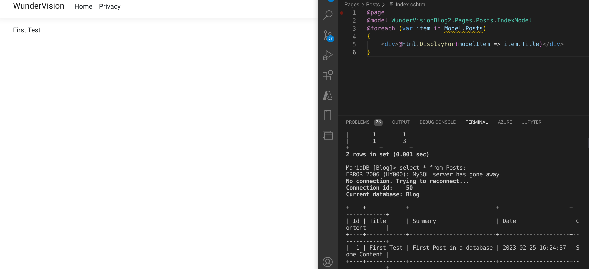
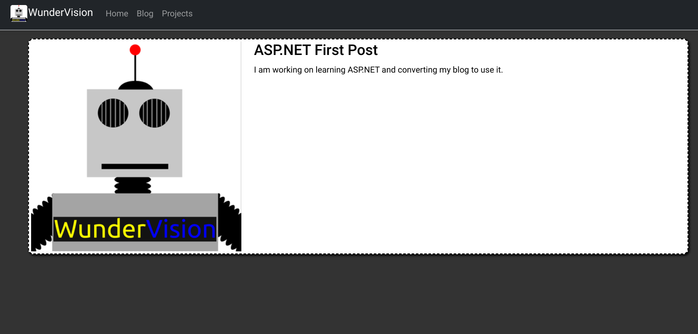
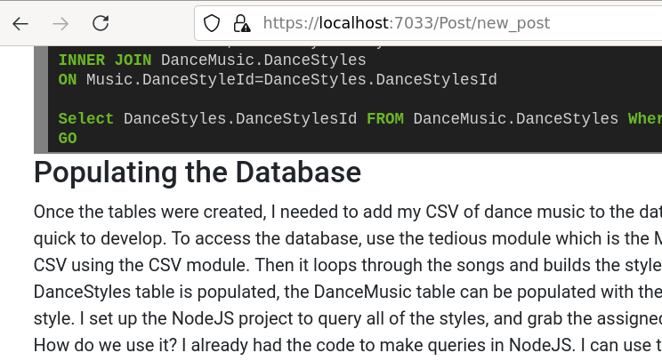

## Introduction
- [Source](https://github.com/Corey255A1/WunderVision-Blog-ASP.Net)

In the [Previous Post](/posts/2023-05-20-asp_blog_database/) I connected up the database and used test code to verify the connection and that my tables were correct.
Now that I have that all squared away it was time to render it using **Razor Pages**.

To render the markdown for the blog posts I installed the **Markdig** Nuget package.

### Helpful Links
- Tutorial about using Razor Pages with EF Core
    - [https://learn.microsoft.com/en-us/aspnet/core/data/ef-rp/intro?view=aspnetcore-8.0&tabs=visual-studio](https://learn.microsoft.com/en-us/aspnet/core/data/ef-rp/intro?view=aspnetcore-8.0&tabs=visual-studio)

## Creating Pages
To start off, I just wanted to get the most basic page created.
I created a **Posts** directory under a **Pages** directory. In that I created two files: **Index.cshtml** and **Index.cshtml.cs**  
The cshtml and cshtml.cs are automatically coupled together as part of the Razor pages frame work. Because the files are named Index, these are what get invoked when you navigate to https://127.0.0.1/Posts
  
In the **Index.cshtml.cs** the Dependency Injection works magically to inject your database context if the constructor includes it as a parameter.  
The **OnGetAsync** is called when a GET is called for the Posts route. When it is called, the _blogContext is used to retrieve all Posts (including the related Tags). The AsNoTracking disables all of the EF Core tracking logic since we won't be doing any modifying in our list view.
```C#
public class IndexModel: PageModel{

    private readonly BlogDBContext _blogContext;
    public IList<BlogPost>? Posts { get; set; }

    public IndexModel(BlogDBContext context){
        _blogContext = context;
    }

    public async Task OnGetAsync(){
        Posts = await _blogContext.Posts.AsNoTracking().Include(p=>p.Tags).ToListAsync();
    }
}
```
   
The **Index.cshtml** is where the Razor syntax comes in. I still don't know all the intricacies of using Razor pages, but in the default Razor project, the _Layout.cshtml is setup to be the base template of your pages with in the application. What you add in these fragments are rendered in the **@RenderBody()** of that template.  



In this snip-it, its just looping all of the Posts in the backing model class and renders a Bootstrap card of the post summary. One thing I wanted to be able to do is use a CDN URL for all of the images. I rather have all the images being sent direct from a high speed CDN rather than sent from my server instance. It was a little tricky on how to get the URL from the **Configuration** that exists in the environment. The syntax below sets up the injection of the configuration. The Configuration can be data that exists in the **appsettings.json** or else where in the server environment. You can define these in the Azure settings of the App server.
```html
@page
@model WunderVisionBlog2.Pages.Posts.IndexModel
@using Microsoft.Extensions.Configuration
@inject IConfiguration Configuration
@{
    string cdnURL = Configuration["CDNURL"]??"";
    ViewData["Title"] = "Blog";
}
<ul class="list-group">
@foreach (var item in Model.Posts)
{
    <li>
        <a class="card bg-color3" href="/Post/@item.URL">
            <div class="row">
                <div class="col-auto">
                    
                </div>
                <div class="col">
                    <h3>@item.Title</h3>
                    <h4>@item.Date.ToShortDateString()</h4>
                    <div>@item.Summary</div>
                </div>
            </div>
        </a>
    </li>
}
</ul>
```  




The @page at the top of the Razor page can be used to modify the URL and get URL parameters.

For instance, to trigger rendering the page for a post:   
```html
@page "/Post/{url}"
@model WunderVisionBlog2.Pages.Posts.PostModel
@{
    ViewData["Title"] = Model.Post?.Title;
}
<div class="content bg-color3">
    <h2>@Model.Post?.Title</h2>
    @Html.Raw(Model.HTMLContent)
</div>
```

Therefore when something like /post/first-post is entered, **url** is set to *first-post* and can be used in the code behind. It is passed in as a argument to the OnGet method if the argument matches the key. This happens automatically.

```C#
public async Task OnGetAsync(string url){
    PageURL = url;
    Console.WriteLine(PageURL);
    Post = await _blogContext.Posts.AsNoTracking().Where(post=>post.URL==url).FirstAsync();
    if(Post == null) { return; }

    HTMLContent = Markdown.ToHtml(Post.Content).Replace("@CDNURL", CDNURL);
}
```

If you noticed in the Razor syntax for the single post view, that I was using the **HTML.Raw** method, this is because my markdown included some HTML that I did not what sanitized.  



I started to get the hang of using Razor pages and displaying content. The next blog post (Still in progress) will be adding in Add and Edit pages