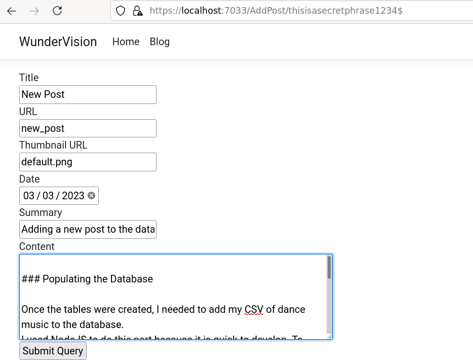

## Introduction
- [Source](https://github.com/Corey255A1/WunderVision-Blog-ASP.Net)

In the [Previous Post](/posts/2023-05-21-asp_blog_razor/) I was rendering the list of posts from the database and created pages to render the individual posts.  

I quickly realized how tedious it was going to be to upload my posts without some kind of front end interface to assist. I could have written a series of scripts but that seemed like it was going to be clunky. This was a good exercise in how to do the C and U part of CRUD.


## Add Post Page
One thing I didn't want to mess around with at the moment was doing authentication and handling logins. That seemed like a diversion and completely unnecessary for a mostly static blog website. (Foreshadowing my foray into using [Hugo](/posts/my-first-hugo-post.md/))

Instead I opted to use a secret url. How secure this really is I'm not sure, but it seemed good enough for a low traffic, uninteresting software engineering blog.
To set this up, I used the @page tag on the Razor page side to setup the route.

```C#
@page "/AddPost/{secret}"
```

On the Get Handler I check if the secret matches the "AddSecret" key that is stored in the configuration.

```C#
public IActionResult OnGet(string secret){
    if(secret != _configuration["AddPostSecret"]){
        return Redirect(@"\Posts");
    }
    
    Console.WriteLine("WOO");
    return Page();
}
```

Now the Post handler is neat. The "id" attribute of the input elements get automatically bound to the properties on the code behind. When the post is submitted, the OnPost is called, and all of the properties of the class are populated with the data from the fields

```html
<form method="post">
    <label for="title">Title</label><br>
    <input id="title" name="title" type="text"><br>
    <label for="url">URL</label><br>
    <input id="url" name="url" type="text"><br>
    <label for="thumbnailurl">Thumbnail URL</label><br>
    <input id="thumbnailurl" name="thumbnailurl" type="text"><br>
    <label for="date">Date</label><br>
    <input id="date" name="date" type="date"><br>
    <label for="summary">Summary</label><br>
    <input id="summary" name="summary" type="text"><br>
    <label for="content">Content</label><br>
    <textarea id="content" name="content" rows="5" cols="50"></textarea><br>
    <input type="submit">
</form>
```

```C#
[BindProperty]
public string? Title { get; set; }

[BindProperty]
public string? URL { get; set; }

[BindProperty]
public string? ThumbnailURL{ get; set; }

[BindProperty]
public string? Summary { get; set; }

[BindProperty]
public DateTime? Date { get; set; }

[BindProperty(Name="Content")]
public string? BlogContent { get; set; }
```

In the case of BlogContent, you can override the name if the property name doesn't match the forum id.


Then in the OnPostAsync method, it again checks the secret, and proceeds to create a new blog post with the properties.

```C#
public async Task<IActionResult> OnPostAsync(string secret){
    Console.WriteLine(secret);
    if(secret != _configuration["AddPostSecret"]){
        return Redirect(@"\Posts");
    }
    BlogPost newPost = new BlogPost(){
        Title=Title,
        ThumbnailURL=ThumbnailURL,
        URL=URL,
        Date=Date??default,
        Summary=Summary,
        Content=BlogContent
    };

    _blogContext.Posts.Add(newPost);
    await _blogContext.SaveChangesAsync();

    return Page();
}
```

And it worked like a charm!



## Edit Post
After I added the Add Post page, and having to make manual changes to the existing posts a few times, I realized I needed to have an Edit page as well.  
The Edit page was almost the exact same, however there were a few key differences.

The route included the post id number
```C#
@page "/EditPost/{id}/{secret}"
```

The HTML had to be pre-populated with the data from the existing post.

```HTML
<form method="post">
    <label for="title">Title</label><br>
    <input id="title" name="title" type="text" value="@Model.CurrentPost?.Title"><br>
    <label for="url">URL</label><br>
    <input id="url" name="url" type="text" value="@Model.CurrentPost?.URL"><br>
    <label for="thumbnailurl">Thumbnail URL</label><br>
    <input id="thumbnailurl" name="thumbnailurl" type="text" value="@Model.CurrentPost?.ThumbnailURL"><br>
    <label for="date">Date</label><br>
    <input id="date" name="date" type="date" asp-for="Date"><br>
    <label for="summary">Summary</label><br>
    <input id="summary" name="summary" type="text" value="@Model.CurrentPost?.Summary"><br>
    <label for="content">Content</label><br>
    <textarea id="content" name="content" rows="5" cols="50">@Model.CurrentPost?.Content</textarea><br>
    <input type="submit">
</form>
```

The Date field, I couldn't just set a string Date value to the value. It had to be in a specific format. Luckily after some research I found that **asp-for** attribute, which automatically formats the field.

In the OnGet method, I get the post by the id. That property is what is used to pre-populate the html.
In the OnPost, I get the post again, update its properties with the new data, and save the changes.

```C#
private async Task<BlogPost?> GetBlogPostAsync(int id)
{
    try{
        return await _blogContext.Posts.Where(post => post.Id == id).FirstAsync();
    }catch(Exception){
        return null;
    }    
}

public async Task<IActionResult> OnGetAsync(int id, string secret)
{
    if (secret != _configuration["AddPostSecret"])
    {
        return Redirect(@"\Posts");
    }

    CurrentPost = await GetBlogPostAsync(id);
    if (CurrentPost == null) { return Redirect(@"\AddPost\" + secret); }

    return Page();
}

public async Task<IActionResult> OnPostAsync(int id, string secret)
{
    CurrentPost = await GetBlogPostAsync(id);
    if (CurrentPost == null) { return Redirect(@"\AddPost\" + secret); }
    Console.WriteLine(secret);
    if (secret != _configuration["AddPostSecret"])
    {
        return Redirect(@"\Posts");
    }

    if (Title != null) { CurrentPost.Title = Title; };
    if (URL != null) { CurrentPost.URL = URL; };
    if (ThumbnailURL != null) { CurrentPost.ThumbnailURL = ThumbnailURL; }
    if (Summary != null) { CurrentPost.Summary = Summary; };
    if (Date != null) { CurrentPost.Date = (DateTime)Date; }
    if (BlogContent != null) { CurrentPost.Content = BlogContent; }

    await _blogContext.SaveChangesAsync();

    return Page();
}
```

And that also worked surprisingly well! I realized though that I could keep iterating on this and making it better, but it was so overkill for the spirit of my blog. I wanted to write about my random programming adventures, not spend all of my coding time programming a blogging engine!

However, this head first jump into databases and using ASP.Net was great. I learned a lot and I can't wait until I come up with another use for it!