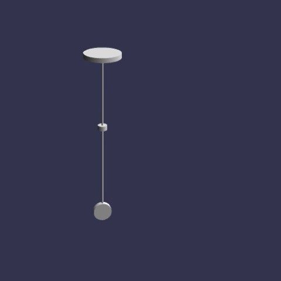
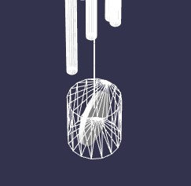
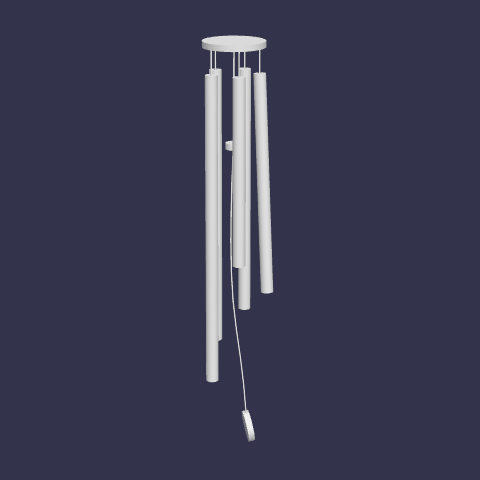
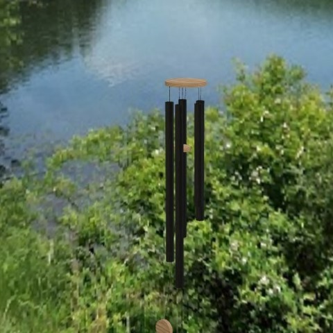

## Introduction

[Source Code](https://github.com/Corey255A1/3DWindChimes)

<div class="embed-youtube">
<iframe width="100%" height="100%" src="https://www.youtube.com/embed/wah_pCGYapE" frameborder="0" allow="accelerometer; autoplay; clipboard-write; encrypted-media; gyroscope; picture-in-picture" allowfullscreen></iframe>
</div>

I had an idea to create a virtual wind chime. I thought that would be a cool project to combine several aspects of virtual and augmented reality. The first step is to build the wind chime shape. I had to create the model as separate pieces to ensure the physics would work correctly. Once the model was created, then it had to simulate the physics of it blowing in the wind. Once that was seemingly working, adding audio queues upon the collisions. I then took it to the next level and added the augmented reality component.

## Building the meshes
I have done a few other small projects in BabylonJS so I am already familiar with the boiler plate that goes into a simple project

What does a classic wind chime consist of? 
There are typically 6 tubes of varying length, hanging in a circle, and another string hanging down the middle with a knocker on it. 

This naturally leads to a WindChime class with WindChimeRod classes 
WindChimeRod can have a length and a radius (and other properties we can mess with as far as generated tones) 
WindChime class can have a radius and an array of rods 
Assume the WindChime will always evenly space the center mount point of the rods.

To create the blower component of the wind chime, I create a cylinder and then rotate it to the side. To make things easier **(This actually turned out to be a mistake.. but is good to know for other things)** with the physics constraints, I used the bakeCurrentTransformIntoVertices method. This then makes the rotation permanent to the mesh where the Y Axis is now across the disc instead of parallel with the cylinder height. 

Because of limitations of the Havok engine currently, I’m going to just split the rope lines into a bunch of cylinders that are attached.

Basically the wind chime is just a bunch of cylinders! However I make the rods eventually using Tubes instead to make them more rod like.



Before I get too deep into the rod creation, I want to see about getting the physics going with the main rope.

## Physics
BabylonJS now includes access to the Havok Physics engine. This is an optimized WASM module. The BabylonJS documentation is a little unclear on what to do. On one document it says to use HavokPlugin().. On a different page it says to use HavokPhysics() 

When using HavokPlugin, the resulting page will indicate that HK is not defined. You have to use HavokPhysics to initialize and load the WASM Module first, and then you can use the Plugin call to start it up. 

Make sure that you are not attempting to create any physics objects before the plug in is initialized.

```typescript
HavokPhysics().then(this.initializePhysics.bind(this));

private initializePhysics(havok: HavokPhysicsWithBindings) {
    const gravityVector = new Vector3(0, -9.81, 0);
    const physicsPlugin = new HavokPlugin(true, havok);

    this._scene.enablePhysics(gravityVector, physicsPlugin);
    this.makeWindchime(new Vector3(0, 1, 0), this._windChimeScale);
    this._canvas.addEventListener('pointerdown', () => {
        this._audioContext.resume();
    }, { once: true });
}
```

However, using the WebPack-DevServer there is no wasm module being hosted. So I copied it up to the www directory so that it can be served. 
It use the HavokPlugin, once the HavokPhysics is initialized, pass it in as an argument. 
The Physics V2 API uses PhysicsAggregate where PhysicsImposter was the V1 API 

As I started digging into making a rope, I realized that the Havok engine is only a Rigid Body simulation. Which means it doesn't simulate things like rope or cloth. To do Soft Body physics, you'd have to use the V1 API with one of the original Physics Engines. This is why I opted to just my own Rope. The Rope class is a bunch of cylinders each connected by a physics BallAndSocket Constraint. Its not perfect, but the simulation winds up pretty good. I did not make this super generic because that seemed like it was going to be its own project, but it works well enough for this project.

```typescript
private makePhysics():Array<PhysicsAggregate>{
    const physicsSegments = this._segments.map(mesh => {
        return new PhysicsAggregate(mesh, PhysicsShapeType.CYLINDER, { mass: this._segmentLength, restitution: 0 }, this._scene);
    });
    const bottomOffset = new Vector3(0, -this._segmentLength / 2, 0);
    const topOffset = new Vector3(0, this._segmentLength / 2, 0);
    physicsSegments.forEach((ropeSegment, index) => {
        if (index == 0) {
            return;
        }
        let joint = new BallAndSocketConstraint(
            topOffset,
            bottomOffset,
            new Vector3(0, 1, 0),
            new Vector3(0, 1, 0),
            this._scene
        );
        ropeSegment.body.addConstraint(physicsSegments[index - 1].body, joint);
    });

    return physicsSegments;
}
```


I was having issues with the rods going a bit crazy at the beginning. Turns out I was making a silly mistake of trying to position the mesh after adding physics to it. You can't really move the Mesh with the position property after adding a Physics Aggregate to it. You have to use the Physics Aggregate to move around the mesh. 

The next thing I noticed was how weird the blower was behaving in the simulated wind. It then occurred to me that the bounding physics shape (Cylinder), is probably not wrapping in the way the I wanted to. I enabled the PhysicsViewer and as I was beginning to suspect, it was not doing what I wanted it to. This was because I rotated the mesh and then baked it to that direction (my mistake from above). I decided to just rotate it and not bake it. Adjusting the offsets was not a big issue. 



Even after getting the cylinder the correct physics shape correct, the wind was still not great. The applyForce method of the physics body, takes a force vector and world position. I wasn't setting the world position correctly. I thought it the force location, and that the force would be applied along the force vector starting at that position. But it really means, it is applying a force to that position with that force vector. My position was way from the center of the physics body, and was the cause of the erratic behavior. I changed it to use the position of the physics body itself, so that the force is applied to the center of the blower object.

```typescript
public applyWind(magnitude: number, location: Vector3) {
    magnitude *= this._radius;
    const windLocation = this._blowerPhyiscs.transformNode.getAbsolutePosition().add(location);
    const windDirection = windLocation.clone().normalize().scale(-magnitude);
    this._blowerPhyiscs.body.applyForce(windDirection, this._blowerPhyiscs.transformNode.getAbsolutePosition());
}
```




I wanted to make the sound vary best on the speed of impact (to a point) and so I needed to get the velocity at the time of impact. From what I could tell event.normal is the normalized vector of the impact.. so I get the velocity of both objects in that direction and subtract them hopefully giving me a rough magnitude of the impact. It seems like it is working well enough for this project
```typescript
this._rodPhysics = new PhysicsAggregate(this._rod, PhysicsShapeType.CYLINDER, { mass: length * scale, restitution: 1 }, scene);
this._rodPhysics.body.setCollisionCallbackEnabled(true);
this._rodPhysics.body.getCollisionObservable().add(this.processCollision.bind(this))


private processCollision(event: IPhysicsCollisionEvent, state: EventState) {
    const v = new Vector3();
    const v2 = new Vector3();
    event.collider.getLinearVelocityToRef(v);
    event.collidedAgainst.getLinearVelocityToRef(v2);
    let impactValue: number = 0;
    if (event.normal) {
        v.multiplyInPlace(event.normal);
        v2.multiplyInPlace(event.normal);
        impactValue = Math.abs(v.lengthSquared() - v2.lengthSquared());
    }
    this.onCollisionEvent.notifyObservers({ windChimeRod: this, impactValue });
    if (this._audio != null) {
        this._audio.play(impactValue);
    }
}
```


## Adding Textures
To give the wind chime a nice environment a I used a 3D photo I created as the skybox.

I researched a little on how to use the PBR Materials. This allows greater control over how the surface of an object looks. I barely scratched the surface on what can be achieved using PBRs. I stumble across a website that had a bambo material that I used for the wooden pieces of the wind chime. 

[https://freepbr.com/materials/bamboo-wood-pbr-material/](https://freepbr.com/materials/bamboo-wood-pbr-material/)



```typescript
    const material = new PBRMaterial('disc_material', scene);
    material.roughness = 1;
    material.metallic = 1;
    //https://freepbr.com/materials/bamboo-wood-pbr-material/
    material.albedoTexture = new Texture('bamboo-wood-semigloss-albedo.png');
    material.bumpTexture = new Texture('bamboo-wood-semigloss-normal.png');
    material.metallicTexture = new Texture('bamboo-wood-semigloss-roughness.png');
    this._discMaterial = material;

    this._body = this.createBody(position, radius, this._discThickness);
    this._body.material = this._discMaterial;
    this._bodyPhysics = new PhysicsAggregate(this._body, PhysicsShapeType.CYLINDER, { mass: 0, restitution: 0 });
```


## Adding Audio
I have used the web audio before in other projects so I was familiar with using it to generate on the fly tones. You have to remember for the audio to work, you need user interaction before initializing the audio context. I went back and forth on the idea of adding the audio to the WindChimeRod class directly, and I decided to make an interface to store rather than my WindChimeAudio class. I'm thinking about possibly in the future using spatial audio, but thats a whole different thing.

When a collision occurs, a callback class the play function with the magnitude of the impact. This is setup to fade out the sound. I added a time threshold to debounce a little bit the impact of the knocker and the rods. 
```typescript
    public play(impactValue: number) {
        if (!this._oscillatorRunning) {
            this._oscillator.start();
            this._oscillatorRunning = true;
        }
        const delta = this._audioContext.currentTime - this._lastStikeTime;
        this._lastStikeTime = this._audioContext.currentTime;
        if (delta > 0.1) {
            const impact = Math.max(impactValue * 10, 0.1);
            if (impact > this._gainNode.gain.value) {
                this._gainNode.gain.cancelScheduledValues(this._audioContext.currentTime);
                this._gainNode.gain.linearRampToValueAtTime(Math.min(0.4, this._gainNode.gain.value + impact), this._audioContext.currentTime + 0.01);
                this._gainNode.gain.exponentialRampToValueAtTime(0.001, this._audioContext.currentTime + 10);
            }
        }

    }
```

## Augmented Reality
BabylonJS makes it very easy to get started in the world of VR and AR. Its a matter of using the **createDefaultXRExperienceAsync** to get everything initialized.
One thing I wanted to do was allow the user to place the wind chime where ever. To do this and keep the physics happy, I decided the best thing to do was destroy the current wind chime and create a new wind chime at the new location. I had to make sure to clean up all of the resources from the previous one and also ensure the math of creating the wind chime was generic enough to be created at arbitrary locations. During development, I had taken some fixed coordinate liberties to speed up the testing.

### Create the AR experience and hide the skybox
```typescript

        this._xrExperience = await this._scene.createDefaultXRExperienceAsync({
            uiOptions: {
                sessionMode: 'immersive-ar'
            },
            optionalFeatures: true
        });
        if(! await this._xrExperience.baseExperience.sessionManager.isSessionSupportedAsync('immersive-ar')){
            const helpText = new TextBlock();
            helpText.text = "Use mobile to enter AR";
            helpText.color = "white";
            helpText.top = "40%";
            helpText.width = "200px";
            helpText.height = "80px";
            this._uiTexture?.addControl(helpText);
            if(this._windButton!=null) { this._windButton.left = "0px"; }
            return;
        }
        this._xrExperience.baseExperience.featuresManager.enableFeature(WebXRBackgroundRemover, "latest", {
            backgroundMeshes: [this._skyBox],
            environmentHelperRemovalFlags: {
                skyBox: true, ground: true
            }
        });

```

### Initialize AR Space
Remove old wind chime, add button to add new wind chime. Create new wind chime and Hit Test location
```typescript 

        this._xrExperience.baseExperience.sessionManager.onXRSessionInit.addOnce(() => {
            this._windChime?.dispose();
            this._windChimeScale = 0.1;
            this._windChime = null;
            this._setPosition = true;

            const positionChime = Button.CreateSimpleButton('positionWindChime', 'Set Position');
            positionChime.onPointerClickObservable.add(() => {
                this._setPosition = true;
            });
            positionChime.width = "160px";
            positionChime.height = "80px";
            positionChime.top = "30%";
            positionChime.left = "80px"
            positionChime.color = 'white';
            positionChime.background = 'green';
            this._uiTexture?.addControl(positionChime);

            const helpText = new TextBlock();
            helpText.text = "Use Set Position to place the windchime in your space";
            helpText.color = "white";
            helpText.top = "40%";
            helpText.width = "100%";
            helpText.height = "80px";
            this._uiTexture?.addControl(helpText);
        });

        const hitTest = this._xrExperience.baseExperience.featuresManager.enableFeature(WebXRHitTest, 'latest', {
            disablePermanentHitTest: true,
            enableTransientHitTest: true
        }) as WebXRHitTest;

        hitTest.onHitTestResultObservable.add((results) => {
            if (this._setPosition && results.length) {
                let position = new Vector3();
                results[0].transformationMatrix.decompose(undefined, undefined, position);
                position.y += 2;
                this.makeWindchime(position, this._windChimeScale);
                this._setPosition = false;
            }
        });
```

This turned out to be a fun little project to delve deeper into the BabylonJS API and a chance to do something in Augmented Reality! I am going to try to do more of these types of projects in the future. So many new things to learn.