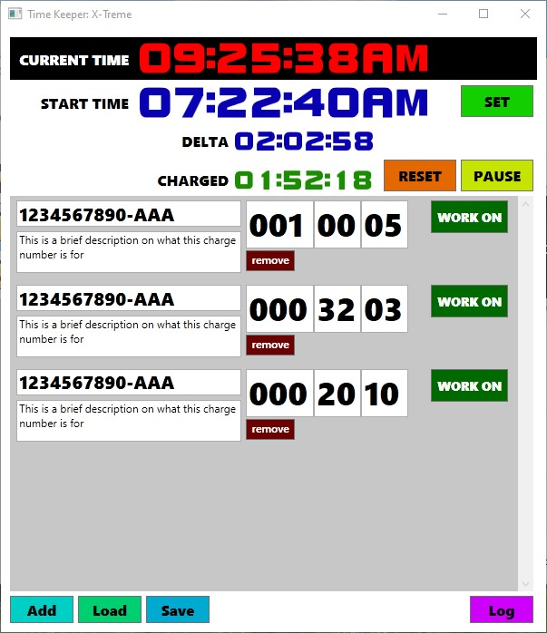
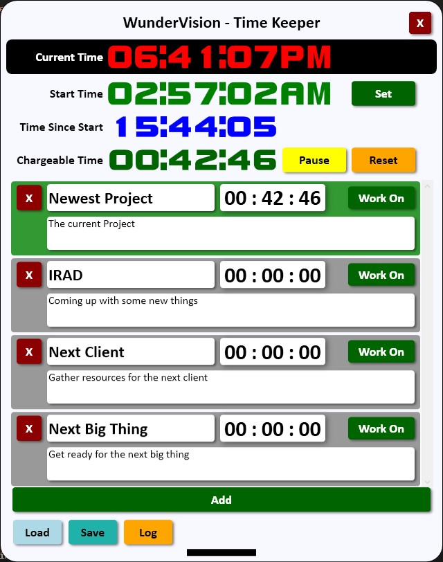
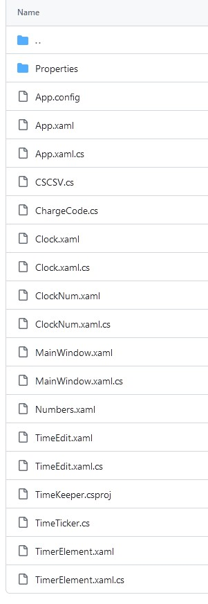
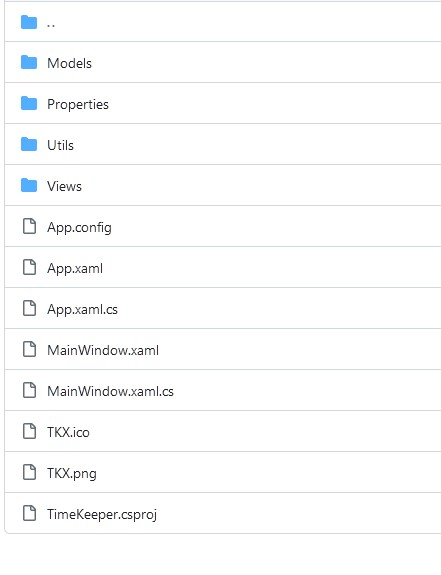

<div class="embed-youtube">
<iframe width="100%" height="100%" src="https://www.youtube.com/embed/_Q6lRqYrB6Y?si=h4A8z1NngJj1Be-O" frameborder="0" allow="accelerometer; autoplay; clipboard-write; encrypted-media; gyroscope; picture-in-picture" allowfullscreen></iframe>
</div>

# Introduction

[Source Code](https://github.com/Corey255A1/TimeKeeper)

My current job requires us to track our time spent on each project. It can get tricky to remember how much time you spent on each project
when you are working on a handful at the same time. Back in 2018, I coded up a simple Time Tracker to make it easier to know what you worked
on through out the day. My co-workers tested it and found various bugs and things, but overall it gets the job done.

The code wasn't pretty. The GUI wasn't pretty.


Over the course of the next 5 years since then, I've learned more about C#, WPF, and coding practices in general. Currently, I've been going back through some of my old projects and cleaning them up.

I made some not-the-best code structure choices that I had to work around, but I managed to clean up a lot of the code, and also make the interface look more appealing and modern.




# Major Code Spruces

## Property Binding
One of the confusing things about WPF when you are first starting is the idea of property binding. It is hard to wrap your mind around your class properties getting magically updated from the controls directly. At the time in 2018, I still didn't understand it, and I just used the GUI elements directly to get values like numbers out of a text box.
During the 2023 refactor, I used Bindings and the INotifyPropertyChanged to decouple the View from the Model. In some places, I also used Dependency Properties.
***
**2018 - TimeEdit.xaml.cs**
```C#
private void secondsBox_LostFocus(object sender, RoutedEventArgs e)
{
    ApplySeconds();
}
private void ApplySeconds()
{
    if (secondsBox == null) return;
    if (secondsBox.Text == "") return;
    int s = Convert.ToInt32(secondsBox.Text);
    SetSeconds(s);
}
private void SetSeconds(int s)
{
    if (s > 59)
    {                
        SetMinutes(minutes + (int)(s / 60));
        s = s % 60;
    }
    seconds = s;
    secondsBox.Text = seconds.ToString("D2");
}
```

**2018 - TimeEdit.xaml**
```xml
<TextBox x:Name="hoursBox" HorizontalAlignment="Left" Height="53" TextWrapping="Wrap" Text="999" VerticalAlignment="Top" Width="75" MaxLines="1" MaxLength="3" TabIndex="0" FontFamily="Segoe UI Black" FontSize="36" PreviewTextInput="numsOnly_PreviewTextInput" LostFocus="hoursBox_LostFocus" PreviewKeyDown="hoursBox_PreviewKeyDown"/>
<TextBox x:Name="minutesBox" HorizontalAlignment="Left" Height="53" TextWrapping="Wrap" Text="59" VerticalAlignment="Top" Width="52" MaxLines="1" MaxLength="2" TabIndex="0" FontFamily="Segoe UI Black" FontSize="36" Margin="75,0,0,0" PreviewTextInput="numsOnly_PreviewTextInput" LostFocus="minutesBox_LostFocus" PreviewKeyDown="minutesBox_PreviewKeyDown"/>
<TextBox x:Name="secondsBox" HorizontalAlignment="Left" Height="53" TextWrapping="Wrap" Text="59" VerticalAlignment="Top" Width="52" MaxLines="1" MaxLength="2" TabIndex="0" FontFamily="Segoe UI Black" FontSize="36" Margin="127,0,0,0" PreviewTextInput="numsOnly_PreviewTextInput" LostFocus="secondsBox_LostFocus" PreviewKeyDown="secondsBox_PreviewKeyDown"/>
```

***
Using binding and some other rework, makes things a lot more flexible

**2023 - TimeEdit.xaml**
```xml
<TextBox Template="{StaticResource HighlightTextBox}" Grid.Column="0" Text="{Binding Time.Hours, StringFormat=D2, FallbackValue=99}" MaxLength="3" TabIndex="0"  PreviewKeyDown="TextBoxPreviewKeyDown" PreviewTextInput="NumbersOnlyPreviewTextInput" />
<TextBlock Grid.Column="1">:</TextBlock>
<TextBox Template="{StaticResource HighlightTextBox}" Grid.Column="2" Text="{Binding Time.Minutes, StringFormat=D2, FallbackValue=00}" MaxLength="2" TabIndex="1" PreviewKeyDown="TextBoxPreviewKeyDown" PreviewTextInput="NumbersOnlyPreviewTextInput"/>
<TextBlock Grid.Column="3">:</TextBlock>
<TextBox Template="{StaticResource HighlightTextBox}" Grid.Column="4" Text="{Binding Time.Seconds, StringFormat=D2, FallbackValue=00}" MaxLength="2" TabIndex="2" PreviewKeyDown="TextBoxPreviewKeyDown" PreviewTextInput="NumbersOnlyPreviewTextInput"/>
```


## Using Styles
In 2018, I just styled all the elements directly. That made it difficult to make things look consistent and is hard to change. Also I just dragged and used margins to position the elements.
During the 2023 refactor, I created styles that can be applied to the elements and I used grids to position the elements. Using a grid makes it much easier to position things around uniformly and change things later on.
***
**2018 - TimerElement.xaml**
```xml
<Button x:Name="workOnBtn" Content="WORK ON" HorizontalAlignment="Left" Margin="457,0,0,0" VerticalAlignment="Top" Width="85" FontFamily="Segoe UI Black" Background="#FF006A00" Foreground="White" Height="36" FontSize="14" Click="workOnBtn_Click"/>
<Button x:Name="removeBtn" Content="remove" HorizontalAlignment="Left" Margin="253,55,0,0" Width="54" FontFamily="Segoe UI Semibold" Background="#FF6A0000" Foreground="White" Height="23" VerticalAlignment="Top" VerticalContentAlignment="Top" Click="removeBtn_Click"/>
```
***
**2023 - TimerElement.xaml**
```xml
<Button Grid.Row="0" Grid.Column="3" Margin="4 0" Width="96" Height="32"  HorizontalAlignment="Right" Content="Work On" Style="{StaticResource GreenButton}" Command="{Binding WorkOnCommand}"/>
<Button Grid.Row="0" Grid.Column="0" Margin="4 0" Content="X" Width="36" Height="36" Style="{StaticResource RedButton}" Command="{Binding RemoveCommand}"/>
```

## Separation of Concerns
In 2018, because I didn't have an understanding of binding, or the concept of Model and View, I had a lot of business logic in the MainWindow.xaml.cs and other code behind areas. During the 2023 refactoring I split out as much as I could easily into a TimeCardController.cs.
***
**2018 - MainWindow.xaml.cs**
```C#
private void addBtn_Click(object sender, RoutedEventArgs e)
{
    var telm = new TimerElement();
    Timers.Add(telm);
    telm.TimerActionPerformed += TimerActionCallback;
    chargeNumberStack.Children.Add(telm);
}

private void pauseBtn_Click(object sender, RoutedEventArgs e)
{
    WorkTimerPaused = true;
}

private void resetBtn_Click(object sender, RoutedEventArgs e)
{
    chargedTimeClk.SetTime(new TimeSpan(0, 0, 0));
    foreach (var telm in Timers)
    {
        telm.Clear();
    }
}
```
***
During the refactor, I connected the buttons to commands that trigger the functions in the TimeCardController

**2023 - TimeCardController.cs**
```C#
public void PauseTimer()
{
    IsWorkTimerRunning = false;
}

public void Reset()
{
    _timeCard.Reset();
    NotifyChange(nameof(TotalWorkTime));
}

public void AddNewChargeCode()
{
    _ = _timeCard.AddNewChargeCode();
}
```

## Consistent Code Style
In 2018, I was all about getting to work functionally. I never thought that 5 years in the future I'd look at the code and be disgusted by it haha.
***
**2018 - MainWindow.xaml.cs - logBtn_Click()**
```C#
 DateTime currTime = DateTime.Now;
string todaysColumn = currTime.ToShortDateString();
if (File.Exists(file))
{
    //If I have the file already, we must add our time for today
    CSCSV.Table lasttable = CSCSV.Table.LoadFromFile(file);
    //If this table doesn't have a column for today, add one
    if (!lasttable.ContainsHeader(todaysColumn))
    {
        lasttable.AddColumn(todaysColumn);
    }
    List<string> chargecodes = lasttable.GetColumn("Charge Codes").ToList();
    int ccCount = chargecodes.Count();
    foreach (string code in timeDict.Keys)
    {
        int idx = chargecodes.IndexOf(code);
        //If the code is already in the list, set the time.
        if (idx >= 0)
        {
            lasttable.SetValue(todaysColumn, idx, timeDict[code].GetTime().ToString());
        }
        else // We will have to add the code..
        {
            lasttable.RowCount += 1;
            lasttable.SetValue("Charge Codes", ccCount, code);
            lasttable.SetValue(todaysColumn, ccCount, timeDict[code].GetTime().ToString());

            ++ccCount;
        }
    }
```
***
In 2023, I made sure everything was using more descriptive names and consistent casing.
**2023 - TimeCard.cs - WriteCSV()**
```C#
DateTime currentTime = DateTime.Now;
string todayColumn = currentTime.ToShortDateString();
CSCSV.Table table = null;
if (File.Exists(path))
{
    table = CSCSV.Table.ReadFromFile(path);
}
else
{
    table = new CSCSV.Table();
}

if (!table.ContainsHeader("Charge Codes"))
{
    table.AddColumn("Charge Codes");
}

//If this table doesn't have a column for today, add one
if (!table.ContainsHeader(todayColumn))
{
    table.AddColumn(todayColumn);
}

List<string> chargeCodes = table.GetColumn("Charge Codes").ToList();
foreach (string code in chargeCodeTimerDict.Keys)
{
    int chargeCodeIdx = chargeCodes.IndexOf(code);
    //If the code is already in the list, set the time.
    if (chargeCodeIdx >= 0)
    {
        table.SetValue(todayColumn, chargeCodeIdx, chargeCodeTimerDict[code].Time.ToTimeSpan().ToString());
    }
    else // We will have to add the code..
    {
        int rowIdx = table.AddRow();
        table.SetValue("Charge Codes", rowIdx, code);
        table.SetValue(todayColumn, rowIdx, chargeCodeTimerDict[code].Time.ToTimeSpan().ToString());
    }
}
```


## Folder Structure
In 2018, I didn't really organize the code in anyway. Everything was just in the main project folder.






# Summary
It was a great exercise to go back through and look at what could have been done better with the lense of experience. Refactoring is an important part of programming. Language features have been changing at a rapid rate, and new technologies are released every day. What might have been several lines of code in the past, might now be simplified into one.

[Latest releases of the executable are here](https://github.com/Corey255A1/TimeKeeper/releases)