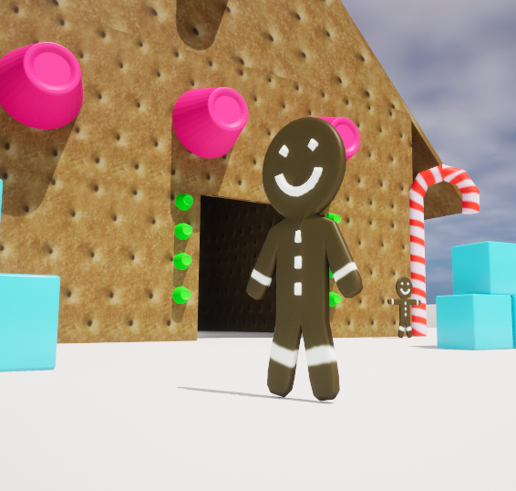

# Introduction
- [Source](https://github.com/Corey255A1/Unreal-GingerbreadMan/)  

There is a Gingerbread Man code jam being hosted by the Orlando Unreal community. I liked the idea of it so I decided to use that as something to work towards and put what I've learned so far into action.  
I like trying to do everything from the ground up, but I don't have the time and patientance to create nice looking assets, but I'm going to try it anyway!

# Creating the Gingerbread Man
## Flatman
I started with a plane for the torso, subdivided, then extruded out the arms and legs.  
Next, I created a circle for the head, and to get the radial spokes, I extrude the circle in place. Then scaled those points down to the center and merged the points. I then subdived those lines as well to get the rings. Then I connected some points points from the head to the body to create a neck.

## Extrudeman
Flatman needs some thickness, so I extruded that plane. Also make sure that any duplicate vertices are removed as well, because that can cause issues later.
To bevel the edges, I selected one entire side, and used the Select Boundary Loops option to select just the outer edge. Then use the bevel tool.

## Adding Features
To build the simple gingerbread man features, I subdivided a couple areas of the chest and then extruded his buttons. With the face I just extruded some of the already existing subdivides. I then beveled the raised pieces to give them a more low res candy shape.

## Texturize
Then to give it a basic gingerbread texture, I marked a seam along the outer edge and then unwrapped the UVs. I've sure there are some better things that could be done, but I don't want to spend a ton of time on the blender part. That could become its entire own project!  
I then painted in the eyes and buttons with some basic coloring.

## Animations
Adding some bones was pretty straight foward since it is a simple mesh. Parent the mesh to the armature and the automatic weights worked well enough for me!

# Make a Candy Cane
The candy cane shape is basically just a bent cylinder. Thats the shape I started with. I then subdivided and then subdivide the upper half and proceded to bend it.

I'm not sure whats going on with the UVs. Again however, I'm not going to spend a ton of time on the assets. haha

# Gum Drop
One more asset I thought would be easy to make is a gum drop.
I'm going to start with a cylinder here also. Make the base bigger than the top. Extrude in the top and lower it down to give it the dimple. Then bevel the edges to make it more a candy shape. For this I'm just going to give it a plain candy color material.

# Exporting and importing to Unreal
Before exporting, since I have all the objects in one blender file, I have to move them to the center before exporting.
When exporting the Gingerbread, I had to make sure to select the skeleton and the mesh because it wasn't exporting it all at once. (I had export only selected on, but didn't know I needed to select all those pieces explicitly)

# Light Bulb
I determined later on that I needed some light bulbs for my game.

In Blender I created a basic light bulb mesh. Assigned two different materials to its faces and exported it. I wanted to have the bulb to have a slight transparency to look like glass.

When importing into Unreal the Blender materials don't translate exactly so I had to tweak the material a bit. I set the Blend Mode to Translucent which enabled the Opacity field. I set that to a Scalar Param for 0.8 to give it a slight transparency.

And that gives us a lo-fi christmas light bulb!

# Level Building
I then started deleting most of the base default level and then coloring the ground and boundary pieces white. This gives it a snowy feel.

I took a quick diversion to create a couple more pieces. A Wall and Triangle piece to make the Gingerbread house. I found a graham cracker image to tweak and use as a texture for these pieces. Then I tweaked the UVs of the Wall and Triangle to make the textures look decent

I built the gingerbread house with the grahamcracker pieces and added some of the candy and other gingerbread men as decorations.

The default SM_ChamferCubes with a light blue texture look great as ice cube blocks.

