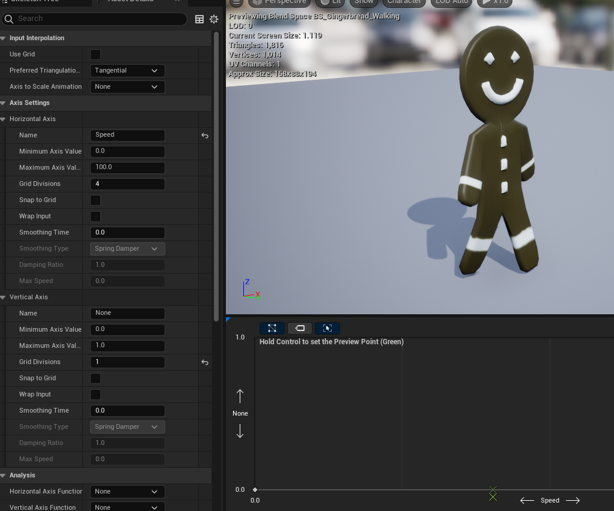
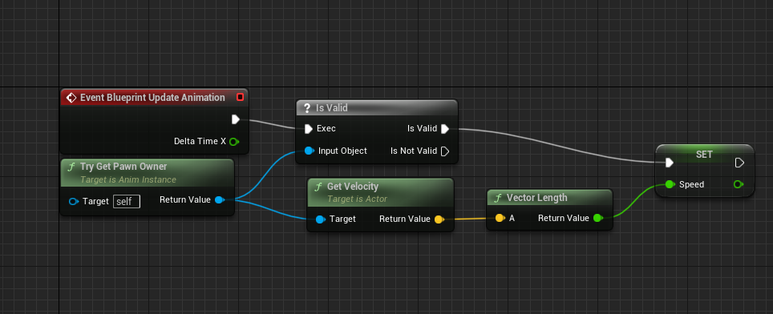
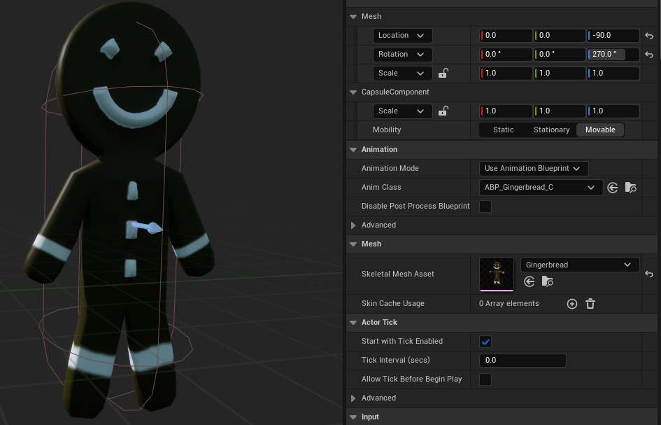
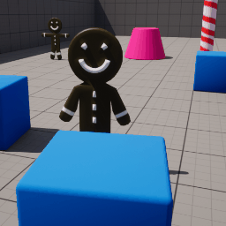

# Introduction
## Post Series
- [Blender Assets]( "Blender Assets")
- [Player Control]( "Player Control")
- [Throw Projectiles]( "Throw Projectiles")
- [Game Play]( "Game Play")
- [HUD and UI]( "HUD and UI")

**[GitHub Source](https://github.com/Corey255A1/Unreal-GingerbreadMan/)**

Now that I have some assets, I'm going to start building a level. I'm starting with the Third Person template and going from there.

# Updating the player character
I already imported the assets from Blender and with those came my animations and skeleton. The first thing I did was update the Skeletal Mesh Asset from the BP_ThirdPersonCharacter Blueprint. This immediately, gives us control of a static gingerbread man. Now, however, I want the walk animation to work correctly.

## Blendspace
To do this, I have to make a new Blendspace. When I started doing this, the standing and walking animations did not blend well. My issue was that the standing animation only had 1 key frame at the start. To make it blend better, I added another key frame at frame 30 so that the walking and standing animations had the same number of frames.  
With in the Blendspace, I have the standing animation at 0,0 and the walking animation at 100,0.
Since I'm using only the horizontal axis for now, I named the horizontal axis **Speed** to be used in the Animation Blueprint

## Animation Blueprint
After the basic Blendspace, it is time to connect it up in the Animation Blueprint. In the AnimGraph I created a Speed variable and connected that to the standing/walking Blendspace. The result of that goes the output pose.  
In the Event Graph, I use the Vector Length of the Pawn's Velocity to tie into the speed of the animation.

## Update the Character Class
I decided to make a copy of the default BP_ThirdPersonCharacter and the BP_ThirdPersonGameMode to customize with our Gingerbread man.
I changed the Skeletal Mesh and the Anim Class to our new Gingerbread man versions.

And with that we have a basic animation tied to our player movement!
The next thing to do is add some other game play elements.

