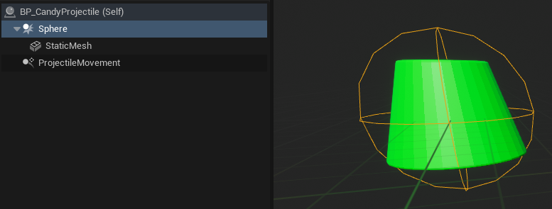
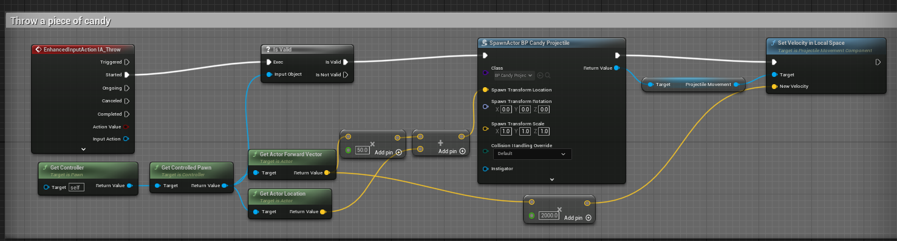
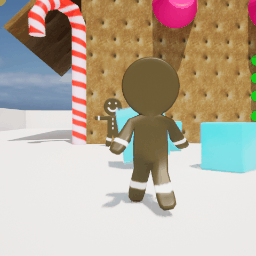
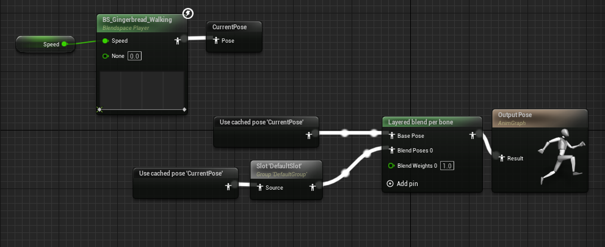
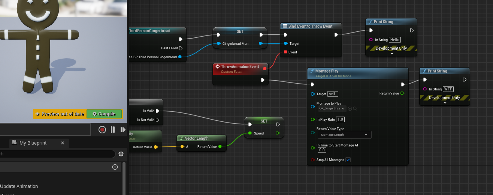
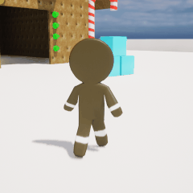

# Introduction
## Post Series
- [GitHub Source](https://github.com/Corey255A1/Unreal-GingerbreadMan/)
- [Blender Assets]( "Blender Assets")
- [Player Control]( "Player Control")
- [Throw Projectiles]( "Throw Projectiles")
- [Game Play]( "Game Play")
- [HUD and UI]( "HUD and UI")
I have some assets. I have a gingerbread man player. Now I can start building out the level and adding some game play elements! First is getting our player to throw some candy projectiles.

# Launching a Projectile
I'm not quite sure what the objective (if any) will be, but I know I want the player to be able to throw those little green gumdrops. I also just realized, that apparently I didn't know what a gumdrop looked like. I'm not sure why I thought they looked like gummy Rolos.

I'm going to start with just getting our player shooting out some .. gumdrop/rolos.

I'm going to copy the Input setup from the ThirdPerson folder into our Gingerbread folder as a basis. Rename the IMC_Default to IMC_Gingerbread, and then in the Character Blueprint where it is Adding Mapping Context in the EventGraph, change that to the new one. To make things less confusing I deleted the old third person inputs. I probably should have just moved them. Doing it this way forced me to update the Character Blueprint which was a minor learning experience.

Next, I created a new EnhancedInputAction for a Throw event. This is then added to the Input Mapping Context. I'm going to make it map to the Left Mouse click and the Ctrl button.

In the Character Blueprint, now I set up an event handler. In the Triggered event, I'm going to spawn a piece of candy in the direction the player is facing.

I needed to make a BP_CandyProjectile to contain the behavior of the projectile.

Then I connect up the Throw action to get the Pawn forward vector, add a little offset, spawn the projectile and give it some velocity in the forward direction.

Rather than have the candy fly out of the gingerbread man, I want him to have a throwing motion. I'm going to give it a try in Blender and next time, figure out how to integrate that with the throwing action!

# Throwing Animation
I'm not quite sure the best way to go about this yet, but I need to mix the walking animation with the throwing animation. To do this I learned about **Layered Blend per Bone**. This allows you to blend only parts of the animation separated by a specified bone.
When you add that object to the AnimGraph of the Animation Blue Print, if you select it there is a Layer Setup setting under Config. If dig down through there, you can add a new Branch Filter to which gives you a **Bone Name** and **Blend Depth** edit box.
The mid section of my Gingerbread Man skeleton is called "Torso" so that is what I'm going to put in the Bone Name field.

This seemed to work. I can see the throwing animation mixed with the walking animation. However, now the question is, how do I trigger this animation?

**Animation Montages** allow you to trigger a sequence of animations. A simple way to create a montage is to right click on an animation and Create new Animation Montage.
Next in the Animation Blueprint AnimGraph, I can take that Montage and add it to the blend node. I'm not quite sure what the Slots are at this point, but I only have one and it is the DefaultSlot.

I take the walking pose and store it in a cache, and then use that is the input to the DefaultSlot. Then I combine those two using the Blend per Bone node.

To Trigger the montage, I created a ThrowEvent. Then in the EventGraph of the Animation BluePrint, I set up an event Handler to trigger the Montage.

Originally I was trying to use "Play Montage" .. but apparently that wasn't working. I'll have to look more into why that wasn't working, but the "Montage Play" node triggered the throwing animation.

I had configured the montage a bit by changing the play rate and start time so that the animation lines up more with the launch of the projectile. The animation itself is kind of slow.  
Ideally, I could line up the project launching with a specific frame using Montage notifications, but I haven't done that before.

