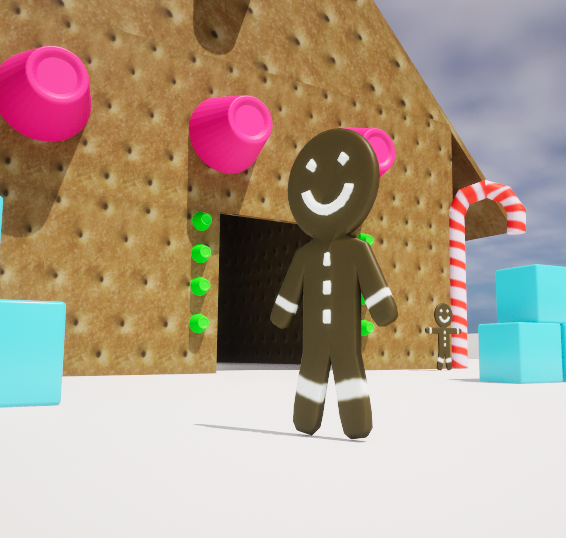

# Introduction
- [Source](https://github.com/Corey255A1/Unreal-GingerbreadMan/)  

I have some assets. I have a gingerbread man player. Now I can start building out the level and adding some game play elements!

# Level Building
I first started by deleting most of the base default level and then coloring the ground and boundary pieces white. This gives it a snowy feel.

I took a quick diversion to create a couple more pieces. A Wall and Triangle piece to make the Gingerbread house. I found a graham cracker image to tweak and use as a texture for these pieces. Then I tweaked the UVs of the Wall and Triangle to make the textures look decent

I built the gingerbread house with the grahamcracker pieces and added some of the candy and other gingerbread men as decorations.

The default SM_ChamferCubes with a light blue texture look great as ice cube blocks.

I'm not quite sure what the object (if any) will be, but I know I want the player to be able to throw those little green gumdrops. I also just realized, that apparently I didn't know what a gumdrop looked like. I'm not sure why I thought they looked like gummy Rolos.

# Throwing action
I'm going to start with just getting our player shooting out some .. gumdrop/rolos.

I'm going to copy the Input setup from the ThirdPerson folder into our Gingerbread folder as a basis. Rename the IMC_Default to IMC_Gingerbread, and then in the Character Blueprint where it is Adding Mapping Context in the EventGraph, change that to the new one. To make things less confusing I deleted the old third person inputs. I probably should have just moved them. Doing it this way forced me to update the Character Blueprint which was a minor learning experience.

Next, I created a new EnhancedInputAction for a Throw event. This is then added to the Input Mapping Context. I'm going to make it map to the Left Mouse click and the Ctrl button.

In the Character Blueprint, now I set up an event handler. In the Triggered event, I'm going to spawn a piece of candy in the direction the player is facing.

I needed to make a BP_CandyProjectile to contain the behavior of the projectile.

Then I connect up the Throw action to get the Pawn forward vector, add a little offset, spawn the projectile and give it some velocity in the forward direction.

Rather than have the candy fly out of the gingerbread man, I want him to have a throwing motion. I'm going to give it a try in Blender and next time, figure out how to integrate that with the throwing action!

