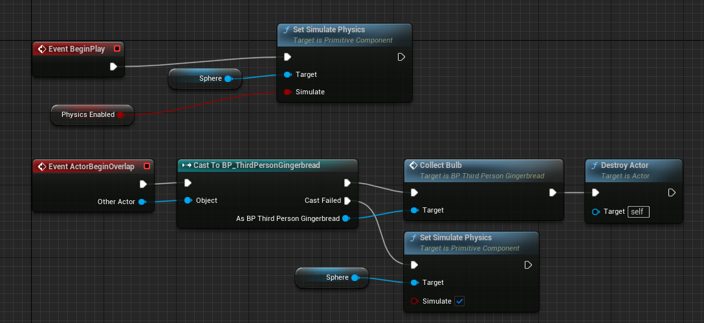
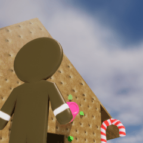
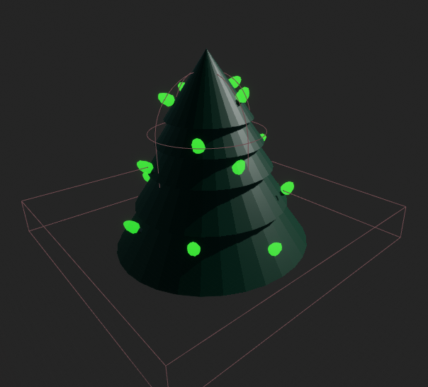
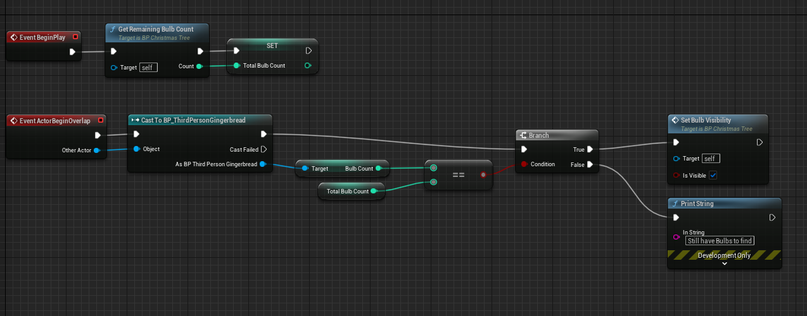
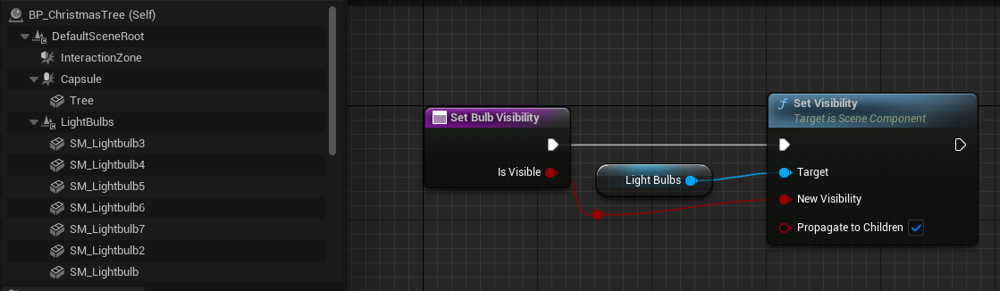
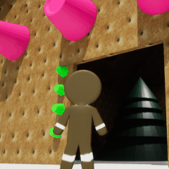

# Introduction
## Post Series
- [GitHub Source](https://github.com/Corey255A1/Unreal-GingerbreadMan/)
- [Blender Assets]( "Blender Assets")
- [Player Control]( "Player Control")
- [Throw Projectiles]( "Throw Projectiles")
- [Game Play]( "Game Play")
- [HUD and UI]( "HUD and UI")

At the end of my last blog post, I had just gotten the player launching some candy projectiles. Now I'm going to add some additional things to the world to make it more interesting.

# Game Objective
Normally you'd develop a game design and plan out your objectives before hand. In this case though I'm just having fun with it and I just now came up with a basic objective.  

The game objective will be to collect some Light Bulbs to fix a burned out Christmas Tree.  

What I'll need is to create a light bulb asset, and distribute those throughout the level. I'll add a HUD overlay to track the amount of light bulbs collected, a region around a Christmas tree to trigger the game completed mode once all the light bulbs have been collected. The Christmas tree should light up once the game has been completed.

# Light Bulb Collection
I'm going to create a Blueprint for the light bulb objects. I gave them a Sphere Collision and set it for Collision Enabled (Query and Physics), Enabled the Physics, and set it to Overlap Pawn. This way the bulbs can have some fun physics.  
On the player character, I created a function called *Collect Bulb* that just increments the number of bulbs.  
In the Bulb blueprint, in the Actor Begin Overlap, I cast it to the Gingerbread blueprint, call the Collect Bulb function, and destroy the light bulb.  

Now I can set the bulbs around in the level to be collected!
I added a boolean to enable/disable the initial setting of the physics. For some of these objects, I just want them to move after getting hit by the gumdrop.

I'm also going to adjust the launching of the projectile to launch in the direction of the camera, so that the player can aim better. To do this I use the Forward Vector of the Follow Camera instead of the Pawn. I then adjusted the Socket Offset of the CameraBoom as well to give a more over the shoulder view of the character.

# Tree Objective
Now that I have a way to collect light bulbs, next is to set up a zone around the tree to detect our player and see if we have met our objectives.

This is accomplished by making a blueprint for the tree, and I set up a box collision around the base of the tree to trigger collisions.

I created a function within in the Tree blueprint to count the amount of lightbulb actors are in the level. In the begin play I use this to set the total light bulbs to find. When the overlap occurs, it compares the amount of light bulbs collected by the character to the total that was counted at the beginning.

In the Tree blueprint, I added some light bulb components under a Light Bulb Scene Component. In the Construction script, I hide that Scene Component and have it propagate to the children. I added this to a new function for reusability purposes. Then in the event graph, if the bulb count has been reached, enable the bulbs!

With that we have some Game Play! Next up is adding a few HUD features.

