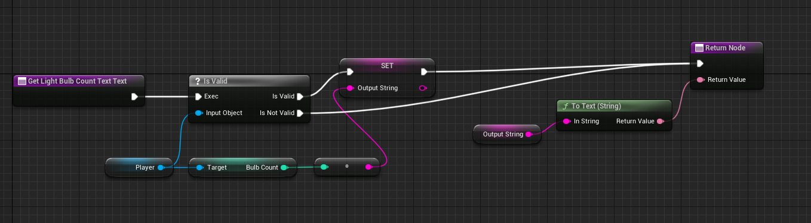
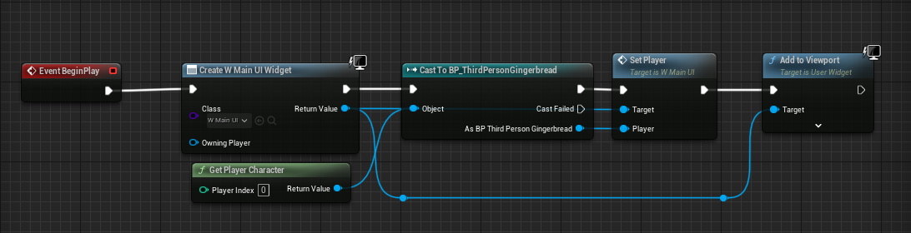
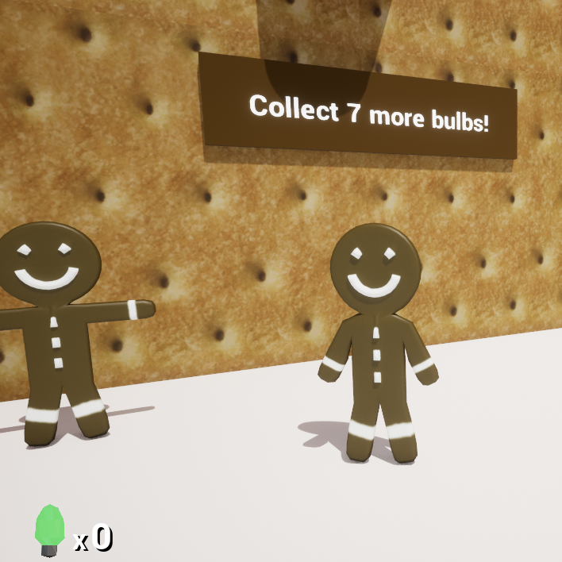
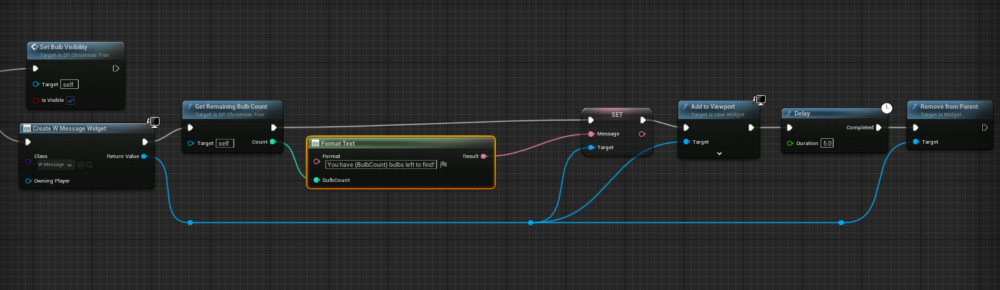
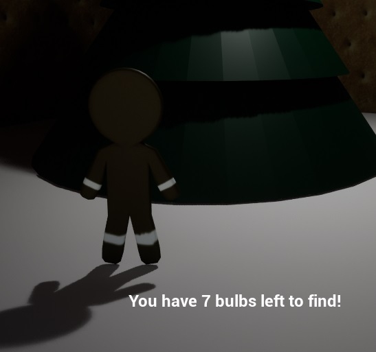
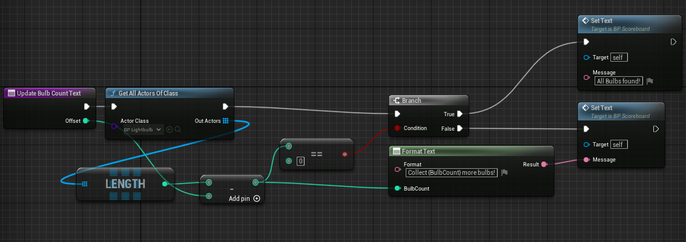
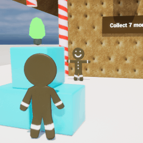

# Introduction
## Post Series
- [Blender Assets]( "Blender Assets")
- [Player Control]( "Player Control")
- [Throw Projectiles]( "Throw Projectiles")
- [Game Play]( "Game Play")
- [HUD and UI]( "HUD and UI")

**[GitHub Source](https://github.com/Corey255A1/Unreal-GingerbreadMan/)**

We have an objective now to collect light bulbs. However, currently there is no way for the user to know how many light bulbs there are to collect, and how many have been collected so far. In this post, I will add a few basic UI elements and some sound to make the game more complete!

<iframe width="100%" height="100%" src="https://www.youtube.com/embed/ejexwNJ2QHo?si=P4ldoObxf2eucafK" frameborder="0" allow="accelerometer; autoplay; clipboard-write; encrypted-media; gyroscope; picture-in-picture" allowfullscreen></iframe>

# HUD Overlay
Games always have some kind of overlay to read out health, or item counts. I'm going to create a simple counter to display the number of light bulbs collected.  
First, I'm creating a Widget Blueprint. This is going to have just a Canvas Panel. In the bottom left corner, I added an image of a light bulb and a x0 for the number of light bulbs.  
I set the 0 text box up for a data binding to get the number of bulbs collected. With the UI I also set up a function to set the current player. I probably could have just used the Get Player pawn trick, but it seems like at some point I need to get away from that.
When the binding is called, I just grab the number of bulbs from the Gingerbread character and that is displayed.

Then in the Level Blueprint I create the UI and add it to the Viewport.

When the user enters the area near the tree, I wanted it to display a text indicating how many light bulbs are remaining to gather.

This is triggered from the Tree blueprint. Creates the widget, sets the Message text (a variable that is bound to a text box in the UI) and then waits 5 seconds before removing it from the view.

This seems like some good basic user feedback!

# Global Counter
One more thing that I wanted was basically a scoreboard to indicate how many light bulbs are remaining.

I created a new blueprint to be the score board. I added a couple of functions to count the number of bulbs and to register if a bulb has been destroyed.

When a bulb is destroyed and invokes the event, I have it recount the amount of bulbs and update the text on the scoreboard. One problem was however that in the Destroyed event, that bulb is still counted. So in those cases, I just subtract 1 from the count before it is displayed.

Now you can look at the scoreboard and see how many bulbs there are left to find in the level!

# Audio Effects
I decided that I needed at least some audio for this to be mostly complete. I found a couple of songs from the Youtube Audio library that were Christmasy. To play the audio, I just dragged it out of the content browser and clicked Enable Audio. Weirdly this creates a object in the world, so I dragged it out of the bounds of our world.

Next I wanted a sound for bulb collection and a sound for bulb throwing.
When a bulb is collected, I play a little bell sound.
When a piece of candy is thrown, I play a little woosh sound.
One thing to keep in mind is that the audio has to be something like a OGG or a WAV file. So I had to convert the two audio files that I grabbed.
I use the Play Sound 2D function to play the audio, and I tied it to the end of the Throw sequence and the dinging to the Collect Bulb function

# Conclusion
This pretty much is the extent of the Gingerbread man project. This was a very fun way to apply a lot of the things I have learned watching the various videos on Udemy and Youtube.