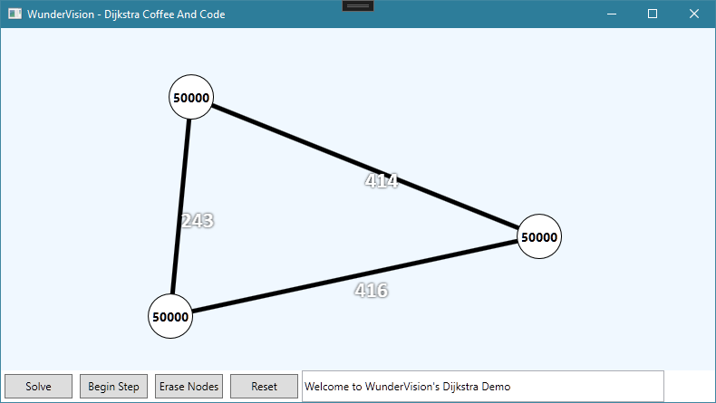

# Introduction
- [Initial Algorithm Refactor]()
- [GUI Refactor Part 1]()
- [GUI Refactor Part 2]()

[Github Source](https://github.com/Corey255A1/DijkstraCoffeeAndCode)

I had just gotten the Edges rendering in the end of the last post. Now its just a matter of tidying up the rest of the GUI events.
- Update the Edges when the nodes are moved
- Render the shortest path
- Render the step by step variation of the algorithm

# Edges
When an edge is created, I have it listen for changes to the Node's vectors. This then triggers updates to its X,Y coordinates. 
My original GUI had a distance read out that would be in the middle of the line. In the view model I have a Distance property that wraps the edges Distance. This is then triggered as well when a Node position is changed.
I wasn't sure if this was going to work, but it seems like it is. I created an EdgeElement UserControl with a Line that is bound to the coordinates. Then the Template Selector used this control, and that seems to work.
To get the Distance to display near the center of the Edge, I have a couple of properties to calculate the Center X,Y of the line, and then use that to position the TextBlock with in a Canvas of the EdgeElement

```xml
<Canvas>
    <Line X1="{Binding X1}" Y1="{Binding Y1}" Y2="{Binding Y2}" X2="{Binding X2}" Stroke="Black" StrokeThickness="5"/>
    <TextBlock Text="{Binding Distance, StringFormat={}{0:#}}" 
                Canvas.Top="{Binding CenterY}" 
                Canvas.Left="{Binding CenterX}" Foreground="White" FontFamily="Calibri" FontSize="24" FontWeight="Bold">
        <TextBlock.Effect>
            <DropShadowEffect ShadowDepth="0" Color="Black" BlurRadius="4"/>
        </TextBlock.Effect>
    </TextBlock>
</Canvas>
```




