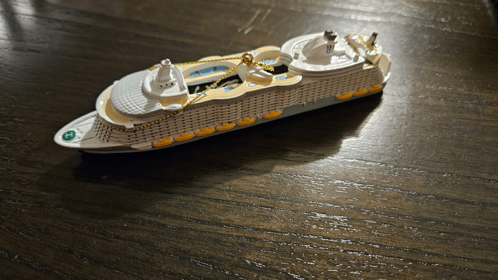
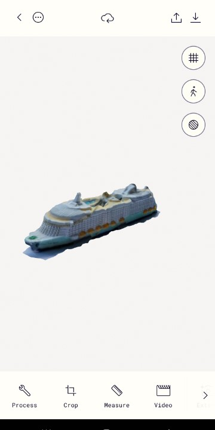
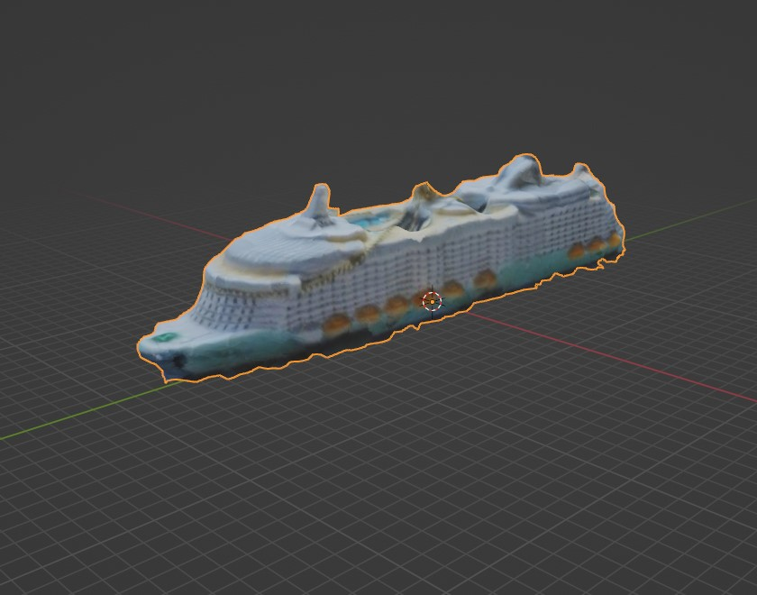
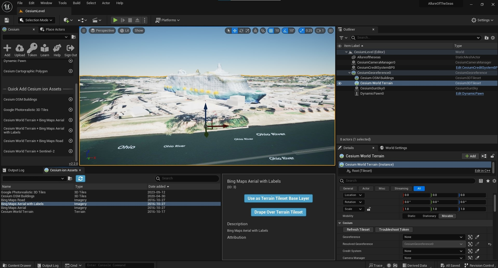
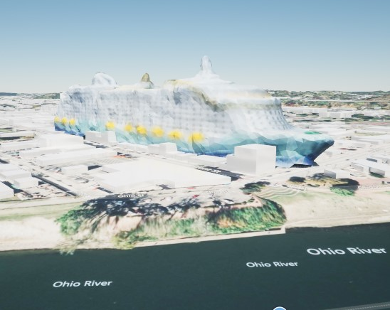

# Introduction

<iframe width="100%" height="100%" src="https://www.youtube.com/embed/-UvXZY7Z9VI?si=m6rfaWlSjqeYyVl9" frameborder="0" allow="accelerometer; autoplay; clipboard-write; encrypted-media; gyroscope; picture-in-picture" allowfullscreen></iframe>

After just coming back from a cruise on Royal Caribbean's Allure of the Seas, I wanted to get a feel for how large this ship was compared to my hometown. 

I have been seeing a lot of things on Photogrammetry and World Scale Unreal projects, so I threw together a quick project to try some things out.

# Getting the Cruise Ship Model
The first thing I needed was a model that was the right scale. Rather than pay money for a high detailed 3D model (which are like $200), I decided to try out an app called [Polycam](https://poly.cam/).

My wife and I like to get Christmas ornaments of our vacations, so I had a scale model of the ship.

I used the Polycam app to convert it to a 3D object. It is obviously not the most highly detailed 3D model. For the purposes of comparing scale to a city, it is fine. From here I was able to export it as a GLB file.

The GLB I imported into Blender. I scaled it up to roughly the correct 362 meter length dimensions, cleaned up some artifacts, and exported as FBX for Unreal. 

# Unreal and Cesium
I was able to easily follow the [Unreal for Cesium Tutorial](https://cesium.com/learn/unreal/unreal-quickstart/) to get a level going.

It didn't seem like I could easily get texture buildings into the world since this is a small town that no one has probably thought of texturing. So the buildings are all blank.

I positioned the ship in the world and did a quick measurement on Bing Maps to ensure the ship dimensions were roughly correct and it looks good enough for this demonstration!

