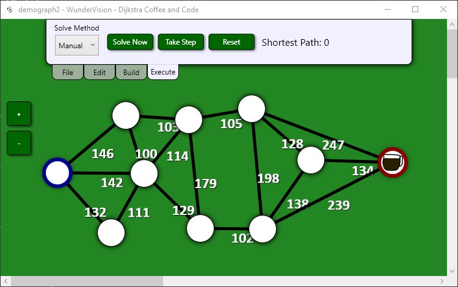
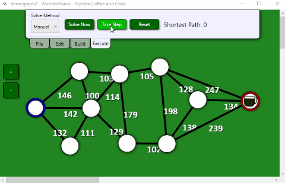
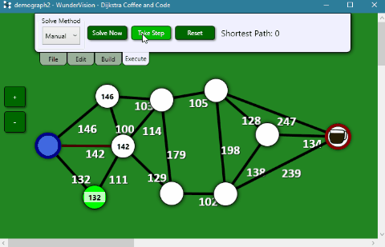
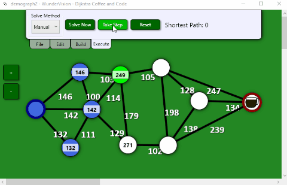

# Introduction
## Post Series

**[GitHub Source](https://github.com/Corey255A1/DijkstraCoffeeAndCode)**
- [Introduction]( "Introduction")
- [UI Overview]( "UI Overview")
- [Commands and Undo]( "Commands and Undo")
- [Style and Animation]( "Style and Animation")

<div class="embed-youtube">
<iframe width="100%" height="100%" src="https://www.youtube.com/embed/Jnjx4tN-yTg?si=k4sY_vvMdMk7V534" frameborder="0" allow="accelerometer; autoplay; clipboard-write; encrypted-media; gyroscope; picture-in-picture" allowfullscreen></iframe>
</div>

Another project that I created in 2018 was a WPF application to view Dijkstra's shortest path algorithm. I pretty much made the UI in a day without a real understanding of WPF. I was also not focused on making it user friendly at all. I was focused on implementing the algorithm as quick as possible.

I rewrote the whole gui to use data binding, commands, and other WPF techniques. I kept the spirit of the original application while adding undo/redo, coordinate editing, zooming, saving, day/night themes, multiselect, and more. It was fun to implement all the core user concepts into an application that doesn't really serve much of a purpose.

# Dijkstra's Algorithm Overview
The algorithm itself is meant to find the shortest path between all nodes in a graph, as long as the distances are all positive. It works by visiting each node only once, and maintaining the current total distance to each node.



It starts by setting all the distances to each node to infinity or max int. Then for each node, check the neighbors. If the total distance between the current node and the neighbor is less than the current total of that neighbor node, then update the distance.



When neighbors are discovered, they are put on a priority queue to be traversed. The queue is sorted by current travel distance, so that it is always spanning the currently known shortest path first.
If it finds a shorter path, the distance is updated for that node.
Once all the neighbors have been checked for a node, that node is marked as visited, and it will not return to that node.



The standard algorithm keeps going until all nodes have been checked, however, if you are looking for a path between two specific nodes, you can stop the algorithm once that node has been reached.




# First Refactoring Steps
My original GUI code, had the algorithm and graphics tightly coupled. There was no way to just run the algorithm without it creating user controls and adding them to the canvas.

The first step was then to create a new Dijkstra DLL project, and implement the core algorithm logic in a shareable way. This allowed me to create console based project as well so that I could quickly define a graph and test that I had implemented the algorithm correctly before diving in the UI.

```C#

var startNode = new Node(0, 0);
var endNode = new Node(4, 0);

var nodeList = new List<Node>()
{
    startNode,
    new Node(2, -1),
    new Node(2, -3),
    new Node(1, 1),
    new Node(2, 1),
    endNode
};

startNode.MakeEdge(nodeList[1]);
startNode.MakeEdge(nodeList[3]);
nodeList[1].MakeEdge(nodeList[2]);
nodeList[2].MakeEdge(nodeList[3]);
nodeList[3].MakeEdge(nodeList[4]);
nodeList[4].MakeEdge(endNode);
nodeList[2].MakeEdge(endNode);

var dijkstraState = Dijkstra.FindShortestPath(startNode, endNode);
foreach (var node in dijkstraState.GenerateShortestPathList())
{
    Console.WriteLine($"{node.Node.Point.X}, {node.Node.Point.Y}");
}

Console.WriteLine($"Shortest Distance {dijkstraState.EndNode.RouteSegmentDistance}");
```

# Overview of Implementation

```C#
public static DijkstraState FindShortestPath(Node startNode, Node endNode)
{
    DijkstraState dijkstraState = new(startNode, endNode);
    while (!dijkstraState.IsFinished)
    {
        while (dijkstraState.HasNodeNeighbors)
        {
            dijkstraState.CheckNextNeighbor();
        }
        dijkstraState.VisitNextNode();
    }
    return dijkstraState;
}
```
The first step in the algorithm is to set the segment distances to all Max distance. In this case, since the start of the algorithm is a fresh creation of DijkstraNodes that happens by default.
We seed the CurrentNodeNeighbors with an initial list of all the neighbors of the start node.

```C#
_currentNodeNeighbors = new Queue<DijkstraNode>(GetOrCreateDijkstraNode(CurrentNode.Node.Neighbors));

private DijkstraNode GetOrCreateDijkstraNode(Node node)
{
    if (!_dijkstraNodes.ContainsKey(node))
    {
        _dijkstraNodes[node] = new DijkstraNode(node);
    }
    return _dijkstraNodes[node];
}

private IEnumerable<DijkstraNode> GetOrCreateDijkstraNode(IEnumerable<Node> nodes)
{
    foreach (var node in nodes)
    {
        yield return GetOrCreateDijkstraNode(node);
    }
}
```

This is a little funky because I'm creating the DijkstraNode classes on the fly. These functions ensure we don't wind up with duplicate containers for the same underlying node.

HasNodeNeighbors and IsFinished are implemented as bool properties that encapsulate underlying state.
```C#
public bool HasNodeNeighbors => _currentNodeNeighbors.Count > 0;
public bool IsFinished => CurrentNode == null || CurrentNode == EndNode || CurrentNode.IsVisited;
```

The reason for CurrentNode.IsVisited is subtle. The Node you are currently checking cannot have already been visited. If that is the case, then something is wrong.

In CheckNextNeighbor, it pulls out the next neighbor out of the CurrentNodeNeighbors queue. This is where it checks the segment distances and determines if the route between these two nodes is less than an already discovered route distance.

```c#
public void CheckNextNeighbor()
{
    if (CurrentNode == null) { return; }

    LastCheckedNeighbor = GetNextNodeNeighbor();
    if (LastCheckedNeighbor == null) { return; }


    LastCheckedNeighbor.UpdateShortestRoute(CurrentNode);
    AddNodeToVisit(LastCheckedNeighbor);
}

// This is with in DijkstraNode.cs
public void UpdateShortestRoute(DijkstraNode node)
{
    double nextRouteDistance = node.RouteSegmentDistance + _node.Distance(node.Node);
    if (nextRouteDistance >= RouteSegmentDistance)
    {
        return;
    }
    ShortestRouteNode = node;
    RouteSegmentDistance = nextRouteDistance;
}
```

The algorithm checks and updates each current neighbor node, and then moves on to the next unvisited node to check.

```C#
public void VisitNextNode()
{
    if (CurrentNode == null) { return; }

    CurrentNode.IsVisited = true;
    CurrentNode = _nodesToVisit.Min((node) => node);
    if (CurrentNode == null) { return; }

    _nodesToVisit.Remove(CurrentNode);
    _currentNodeNeighbors = new Queue<DijkstraNode>(GetUnvisitedNeighborNodes(CurrentNode));

    LastCheckedNeighbor = null;
}
```

The NodesToVisit is a Hash to ensure that duplicate Nodes are not added. The algorithm describes using a Priority queue to ensure that the graph is traversed by the shortest route distance first. In this case, I am just calling Min to retrieve the Node with the shortest RouteSegmentDistance.

In the DijkstraNode I implemented the < > operators to make that Min call a little cleaner.
```c#
public static bool operator <(DijkstraNode left, DijkstraNode right)
{
    return left.RouteSegmentDistance < right.RouteSegmentDistance;
}

public static bool operator >(DijkstraNode left, DijkstraNode right)
{
    return left.RouteSegmentDistance > right.RouteSegmentDistance;
}

public int CompareTo(DijkstraNode? other)
{
    if (other == null) { throw new ArgumentNullException("other"); }
    if (other == this) { return 0; }
    return (int)(RouteSegmentDistance - other.RouteSegmentDistance);
}
```

This keeps iterating until IsFinished is true or an exception is hit because the graph is invalid.

The TakeStep function just replaces the While loops with If Checks and takes in a DijkstraState to process.

```C#
public static DijkstraState TakeStep(DijkstraState dijkstraState)
{
    if (!dijkstraState.IsFinished)
    {
        if (dijkstraState.HasNodeNeighbors)
        {
            dijkstraState.CheckNextNeighbor();
            return dijkstraState;
        }
        dijkstraState.VisitNextNode();
        return dijkstraState;
    }
    return dijkstraState;
}
```

# Lessons Learned
Initially I created Nodes, Edges and a subclass of Node - DijkstraNode. The Nodes had a list of Edges that we objects that contained a reference to a connected node. That is the way that I had created it back in 2018 and my first pass at refactoring persisted that. Also my Dijkstra algorithm only took as arguments DijkstraNodes, which I felt was too constraining so I had to revise some things to get it to work.

The Nodes, I refactored to instead of storing the edges, to just store directly the reference to the neighbors. This was because when I went to save and load, or undo, redo it became complicated to maintain the Edges. It was easier to store the Nodes with a unique ID and then if nodes are deleted, recreated, or imported, the connections can be recreated.

The Dijkstra Algorithm class itself, I wound up using a DijkstraState class to maintain the current solved state. When the Nodes are passed in initially to start the algorithm, it then creates a DijkstraNode wrapper around the Node. This allows the algorithm to work with any Node class. As the algorithm continues it maintains a Dictionary of which Nodes it has already created a DijkstraNode. Its a little clunky, but it has the benefit of not having to traverse the whole tree first to create all the DijkstraNodes.

The DijkstraState is iterated over until the End has been reached or the algorithm determines it is not solvable. This enables the Step function from the original 2018 concept. After each step, the current state can be retrieved and the GUI updated to reflect where it is in the process.

Next up I will discuss some of the various GUI elements. [UI Overview]( "UI Overview")