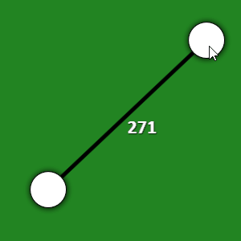
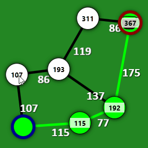

# UI Overview
## Post Series

**[GitHub Source](https://github.com/Corey255A1/DijkstraCoffeeAndCode)**
- [Introduction]( "Introduction")
- [UI Overview]( "UI Overview")
- [Commands and Undo]( "Commands and Undo")
- [Style and Animation]( "Style and Animation")

The last post I discussed briefly Dijkstra's algorithm and some things that I did to split the algorithm solving code out in to its own library for easier testing. Now we'll get in to how the various GUI elements are implemented.

# Node Canvas
## Naive approach to managing a canvas of items
In 2018, without understanding how databinding can be used, I wrote most of the code in the codebehind of the MainWindow. When the user would add a node I would create a new Node usercontrol and add it to the canvas manually. 
Its also checking if you are selecting a node and directly updating the selected nodes list. And I'm even managing the solving part of the algorithm directly in the mouse callback.
Not great.
```C#
        private void graphCanvas_MouseLeftButtonDown(object sender, MouseButtonEventArgs e)
        {
            if (e.Source.GetType() != typeof(NodeElement))
            {
                Point p = e.GetPosition(graphCanvas);
                var ne = new NodeElement() { CanvasPosition = p };
                CreatedNodes.Add(ne);
                ShortestPathClass.Add(ne.theNode);
                Canvas.SetZIndex(ne, 1);
                graphCanvas.Children.Add(ne);
                ShortestPathClass.ResetStepAlgo();
                stepBtn.Content = "Begin Step";
            }
            else
            {
                var nelm = e.Source as NodeElement;
                if (!nelm.Selected && SelectedNodes.Count<2)
                {
                    SelectedNodes.Add(nelm);
                    nelm.Selected = true;
                }
                else if(nelm.Selected)
                {
                    SelectedNodes.Remove(nelm);
                    nelm.Selected = false;
                }                
            }
        }

```

## Better approach to the canvas
Now in 2024, I want to try to align with the Model View ViewModel approach. Which I find sometimes to really over complicate some things, but in general does result in cleaner more segmented code.

The new approach uses an **ItemsControl** that is bound is a list of GraphViewObjects. You can then set the ItemsPanelTemplate to Canvas, and just like that, items you add to the GraphViewObjectModel collection, are rendered to the canvas. To get the items to position correctly with the X,Y coordinates, the ItemContainerStyle implements a ContentPresenterStyle that binds the Left, Top and Zindex to the underlying viewmodel of the object.

```xml
<ItemsControl Background="{DynamicResource graphFieldColorBrush}" 
        Width="2048" Height="2048" Grid.Row="0" 
        ItemsSource="{Binding Path=Graph.GraphViewObjects}" 
        MouseLeftButtonDown="CanvasMouseLeftButtonDown">
    <ItemsControl.Resources>
        <DataTemplate DataType="{x:Type vm:NodeViewModel}">
            <views:NodeElement DataContext="{Binding }" />
        </DataTemplate>
        <DataTemplate DataType="{x:Type vm:EdgeViewModel}">
            <views:EdgeElement DataContext="{Binding }" />
        </DataTemplate>
    </ItemsControl.Resources>
    <ItemsControl.ItemsPanel>
        <ItemsPanelTemplate>
            <Canvas/>
        </ItemsPanelTemplate>
    </ItemsControl.ItemsPanel>
    <ItemsControl.ItemContainerStyle>
        <Style TargetType="ContentPresenter">
            <Setter Property="Canvas.Left" Value="{Binding Left}"/>
            <Setter Property="Canvas.Top" Value="{Binding Top}"/>
            <Setter Property="Canvas.ZIndex" Value="{Binding ZIndex}"/>
        </Style>
    </ItemsControl.ItemContainerStyle>
</ItemsControl>
```

The DataTemplate definitions automatically create the appropriate View for the ViewModel type of the object. 

# NodeElement View
For the NodeElement View, the X,Y of the underlying Node has to be at the center of the UI element. In the ViewModel it calculates the Left and Top based on the height and width and the center X,Y of the node.

I wanted it to have a Right click menu. These are bound to the appropriate Commands that we will get into in another post on how they are implemented. Most of the color styles have been set to a style resource. This is fundamental to the Color Scheming mechanism.

**Node**
```xml
<Grid>
    <Grid.ContextMenu>
        <ContextMenu>
            <MenuItem Header="Start Node" Command="{Binding SetAsStartCommand}"></MenuItem>
            <MenuItem Header="End Node" Command="{Binding SetAsEndCommand}"></MenuItem>
            <MenuItem Header="Delete" Command="{Binding DeleteCommand}"></MenuItem>
        </ContextMenu>
    </Grid.ContextMenu>

    <Ellipse Style="{StaticResource ResourceKey=node}" Margin="2" Height="Auto" Width="Auto" Stroke="Black"  MouseMove="NodeMouseMove" MouseLeftButtonDown="NodeMouseDown" MouseLeftButtonUp="NodeMouseUp">
        <Ellipse.BitmapEffect>
            <DropShadowBitmapEffect Color="Black" ShadowDepth="0.5" Softness="0.5"/>
        </Ellipse.BitmapEffect>
    </Ellipse>
    <Rectangle Style="{StaticResource ResourceKey=thumb}" Margin="8,8,8,8" IsHitTestVisible="False"/>
    <Label IsHitTestVisible="False" BorderThickness="0"
           Content="{Binding RouteSegmentDistance, Converter={StaticResource doubleToIntConv}}" 
           Margin="5,15" Padding="0" HorizontalContentAlignment="Center" FontSize="14" FontWeight="Bold" Background="#BFFFFFFF" VerticalContentAlignment="Center">
        <Label.Visibility>
            <Binding Path="RouteSegmentDistance" Converter="{StaticResource hideableNumberConv}">
                <Binding.ConverterParameter>
                    <sys:Double>0</sys:Double>
                </Binding.ConverterParameter>
            </Binding>
        </Label.Visibility>
    </Label>
    <Ellipse IsHitTestVisible="False" Style="{StaticResource ResourceKey=ringIndicator}" Height="Auto" Width="Auto"/>
</Grid>
```

# EdgeElement View
For the EdgeElement, it was a little tricky to figure out how that was going to work because the Edge has to render a line between two points on the canvas. The Edge, I wound up just having it also have a canvas to render the line in. Then the end points of the line are just set to the two end point coordinates and because the Edge object stretches the whole size of the parent canvas, the coordinates line up. This might not be the most efficient way to do it, however the performance seems to be OK for the size of the graphs that this demonstration deals with.

**Edge**
```xml
 <Canvas>
     <Line Style="{DynamicResource highlightLine}" X1="{Binding X1}" Y1="{Binding Y1}" Y2="{Binding Y2}" X2="{Binding X2}"/>
     <TextBlock Text="{Binding Distance, StringFormat={}{0:#}}" 
                Canvas.Top="{Binding CenterY}" 
                Canvas.Left="{Binding CenterX}" Foreground="White" FontFamily="Calibri" FontSize="24" FontWeight="Bold">
         <TextBlock.Effect>
             <DropShadowEffect ShadowDepth="1" Color="Black" BlurRadius="2"/>
         </TextBlock.Effect>
     </TextBlock>
 </Canvas>
```

Another tricky thing about the Edge, is that it's position has to change when its Node positions change.
This is handled in the ViewModel by adding a event listener to the coupled nodes.

```C#
public EdgeViewModel(Edge edge)
{
    _edge = edge;
    _edge.Node1.Point.VectorChanged += Node1PositionChanged;
    _edge.Node2.Point.VectorChanged += Node2PositionChanged;
}

private void Node1PositionChanged(Vector2D position)
{
    Notify(nameof(X1));
    Notify(nameof(Y1));
    NotifyPositions();
}

private void Node2PositionChanged(Vector2D position)
{
    Notify(nameof(X2));
    Notify(nameof(Y2));
    NotifyPositions();
}
```



# Adding and Selecting
For Adding new Nodes, I took a bit of a short cut, by adding a little code behind in the MainWindow. This is because to bind a command to a mouse click seems overly complicated, and so I opted for the handful of code option.

```c#
private bool AddNodeKeyDown()
{
    return Keyboard.GetKeyStates(Key.LeftCtrl).HasFlag(KeyStates.Down) ||
        Keyboard.GetKeyStates(Key.RightCtrl).HasFlag(KeyStates.Down);
}
private void CanvasMouseLeftButtonDown(object sender, MouseButtonEventArgs e)
{
    if(!AddNodeKeyDown()) { return; }
    Point clickPoint = e.GetPosition(sender as FrameworkElement);
    if (_viewModel.Graph.MakeNewNodeCommand.CanExecute(null))
    {
        _viewModel.Graph.MakeNewNodeCommand.Execute(new Vector2D(clickPoint.X, clickPoint.Y));
    }
} 
```

In the mouse button handler, I check if the Control button is down, and then invoke the MakeNewNodeCommand on the viewmodel with the coordinates of the click. This is routes to the MakeNewNode of the BaseGraphViewModel and invokes the AddNode of the underlying Graph object. The Graph class is in the DijkstraAlgorithm project and makes it easier to manage the Nodes and Edges that are created. These are bound to by the ViewModel to then create the ViewModels based on the underlying Models.

```C#
public Node MakeNewNode(double x, double y)
{
    return _graph.AddNode(x, y);
}

//In the Graph.cs
private Node AddNode(uint id, double x, double y)
{
    _nextNodeID = Math.Max(id, _nextNodeID);
    Node node = new(id, x, y);
    _nodes.Add(node);
    return node;
}

public Node AddNode(double x, double y)
{
    return AddNode(GetNodeID(), x, y);
}

```

I created a generic GraphObjectViewCollection to handle the creation and deletion of ViewModel objects based on the Model list.

```c#
_graph = graph;
_nodeViewCollection = new(_graph.Nodes, _nodeViewModelFactory);
_nodeViewCollection.AddOrRemove += AddOrRemoveNodeViewModel;

foreach (var nodeView in _nodeViewCollection.Values)
{
    AddOrRemoveNodeViewModel(nodeView, true);
}
```

Then I can listen for the Nodes or Edges collection changes and create the ViewModel based on the passed in ViewModel factory. This reduces the amount of code duplication.

```C#
public void CollectionChangedHandler(object? sender, NotifyCollectionChangedEventArgs e)
{
    switch (e.Action)
    {
        case NotifyCollectionChangedAction.Add:
            {
                if (e.NewItems == null || e.NewItems.Count == 0) { return; }
                if (!(e.NewItems[0] is K dijkstraObject)) { return; }
                AddNewObjectViewModel(dijkstraObject);
            }
            break;

        case NotifyCollectionChangedAction.Remove:
            {
                if (e.OldItems == null || e.OldItems.Count == 0) { return; }
                if (!(e.OldItems[0] is K dijkstraObject)) { return; }
                RemoveObjectViewModel(dijkstraObject);
            }
            break;
    }
}

public void AddNewObjectViewModel(K item)
{
    V objectToAdd = viewFactory.Invoke(item);
    _objectToViewModel.Add(item, objectToAdd);
    AddOrRemove?.Invoke(objectToAdd, true);
}

public void RemoveObjectViewModel(K node)
{
    GraphObjectViewModel objectToRemove = GetViewModel(node);
    _objectToViewModel.Remove(node);
    AddOrRemove?.Invoke(objectToRemove, false);
}
```


The Node selection part is starts in the NodeElement itself. It handles the MouseUp Down and Move events and forwards those up through a NodeUserInteraction event.
To handle the click and drag, there is a certain threshold of a drag position for it to start the drag process. This prevents accidental drags when trying to select the node.
When a user clicks a Node without moving it, the GraphViewModel checks this and then adds it to the SelectedNode list.

```c#
protected virtual void NodeUserInteractionHandler(object? sender, NodeUserInteractionEventArgs e)
{
    if (!(sender is NodeViewModel node)) { return; }

    switch (e.State)
    {
        case NodeUserInteractionState.BeginInteraction:
            OnNodeBeginInteraction(node);
            break;
        case NodeUserInteractionState.BeginDrag:
            OnNodeBeginDrag(node);
            break;
        case NodeUserInteractionState.EndDrag:
            OnNodeEndDrag(node);
            break;
        case NodeUserInteractionState.ContinueDrag:
            OnNodeContinueDrag(node, e);
            break;
        case NodeUserInteractionState.EndInteraction:
            OnNodeEndInteraction(node);
            break;
        case NodeUserInteractionState.Delete:
            OnNodeDelete(node);
            break;
    }
}

protected virtual void OnNodeEndInteraction(NodeViewModel node)
{
    if (!node.WasMovedWhileInteracting)
    {
        ToggleSelectedNode(node, IsMultiSelectMode());
    }
}

public void ToggleSelectedNode(NodeViewModel node, bool isMultiSelect = false)
{
    if (node.IsSelected)
    {
        if (SelectedNodesCount > 0 && !isMultiSelect)
        {
            SelectNode(node, false);
        }
        else
        {
            UnselectNode(node);
        }
    }
    else
    {
        SelectNode(node, isMultiSelect);
    }
}
```

The SelectedNodes are actually added to a SelectedNode Manager. This is used to tie to some Command IsExecutable properties of commands select as DeleteSelectedNodesCommands.

# Representing the Dijkstra State
After each step, or after a full run of the algorithm, the resulting Dijkstra State is used to update the viewmodels of the nodes and edges. Properties such as IsHighlighted, IsVisited, our RouteSegmentDistance are all data bound to the view. In the Style



```xml
 <Style TargetType="Ellipse" x:Key="node">
     <Setter Property="Fill" Value="{StaticResource nodeDefaultColorBrush}"/>
     <Style.Triggers>
         <DataTrigger Binding="{Binding IsVisited}" Value="true">
             <Setter Property="Fill" Value="{StaticResource nodeVisitedColorBrush}"/>
         </DataTrigger>
         <DataTrigger Binding="{Binding IsHighlightedAlternate}" Value="true">
             <Setter Property="Fill" Value="{StaticResource highlightAltColorBrush}"/>
         </DataTrigger>
         <DataTrigger Binding="{Binding IsHighlighted}" Value="true">
             <Setter Property="Fill" Value="{StaticResource highlightColorBrush}"/>
         </DataTrigger>
         <DataTrigger Binding="{Binding IsSelected}" Value="true">
             <Setter Property="Fill" Value="{StaticResource selectedColorBrush}"/>
         </DataTrigger>
     </Style.Triggers>
 </Style>
```

```c#
public void HighlightRoute(List<Node> nodes)
{
    for (int nodeIndex = 0; nodeIndex < nodes.Count; nodeIndex++)
    {
        var currentNode = nodes[nodeIndex];

        var nodeViewModel = GetViewModel(currentNode);
        nodeViewModel.IsHighlighted = true;

        if (nodeIndex < nodes.Count - 1)
        {
            var nextNode = nodes[nodeIndex + 1];
            Edge? sharedEdge = GetEdge(currentNode, nextNode);
            if (sharedEdge == null) { throw new Exception("No Edge found between route nodes"); }

            var edgeViewModel = GetViewModel(sharedEdge);
            edgeViewModel.IsHighlighted = true;
        }
    }
}

public void UpdateDijkstraView(DijkstraState dijkstraState)
{
    ResetAllDijkstraViewObjects();
    foreach (var node in dijkstraState.DijkstraNodes)
    {
        var nodeViewModel = GetViewModel(node.Node) as DijkstraNodeViewModel;
        if (nodeViewModel == null) { continue; }

        nodeViewModel.RouteSegmentDistance = node.RouteSegmentDistance;
        if (!dijkstraState.IsFinished)
        {
            nodeViewModel.IsVisited = node.IsVisited;
        }
    }

    if (dijkstraState.IsFinished)
    {
        var shortestPathList = dijkstraState.GenerateShortestPathList();
        ShortestPathDistance = (int)Math.Round(dijkstraState.EndNode.RouteSegmentDistance);
        HighlightRoute(shortestPathList.Select(dijkstraNode => dijkstraNode.Node).ToList());
    }
    else
    {
        ShortestPathDistance = 0;
        if (dijkstraState.CurrentNode == null)
        {
            throw new Exception("Invalid Dijkstra State");
        }
        var nodeViewModel = GetViewModel(dijkstraState.CurrentNode.Node);
        nodeViewModel.IsHighlighted = true;

        if (dijkstraState.LastCheckedNeighbor != null)
        {
            nodeViewModel = GetViewModel(dijkstraState.LastCheckedNeighbor.Node);
            nodeViewModel.IsHighlightedAlternate = true;
            var neighborEdge = GetEdge(dijkstraState.LastCheckedNeighbor.Node, dijkstraState.CurrentNode.Node);
            if(neighborEdge != null)
            {
                GetViewModel(neighborEdge).IsHighlightedAlternate = true;
            }
        }
    }
}
```

Next I'll go over how the commands are handled through out the code and the undo/redo mechanism. [Commands and Undo]( "Commands and Undo")

