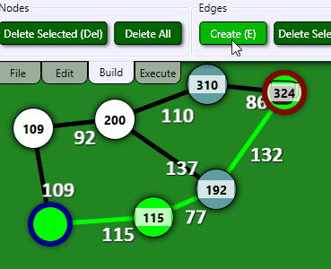
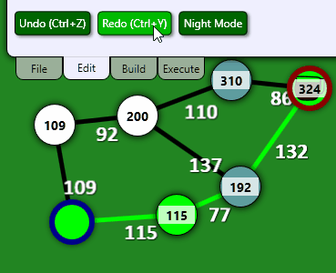

# Commands and Undo
## Post Series

**[GitHub Source](https://github.com/Corey255A1/DijkstraCoffeeAndCode)**
- [Introduction]( "Introduction")
- [UI Overview]( "UI Overview")
- [Commands and Undo]( "Commands and Undo")
- [Style and Animation]( "Style and Animation")

<div class="embed-youtube">
<iframe width="100%" height="100%" src="https://www.youtube.com/embed/Jnjx4tN-yTg?si=k4sY_vvMdMk7V534" frameborder="0" allow="accelerometer; autoplay; clipboard-write; encrypted-media; gyroscope; picture-in-picture" allowfullscreen></iframe>
</div>

WPF has the ability to bind Commands from the viewmodel to Buttons and Menu options on the view. This also gives flexibility in sharing those commands between different buttons or selections without have to create click handlers for each one on the view.
Also when using Commands it becomes easier to funnel those commands into an Undo/Redo system.

# Commands
To use a command, it has to implement the ICommand interface. This has three components, CanExecuteChanged, CanExecute and Execute. The CanExecute function enables automatic disabling of the buttons or menus.

I created some Keybindings also for a few of the common commands.

```xml
<Window.InputBindings>
    <KeyBinding Command="{Binding Graph.CreateEdgesCommand}" Key="E"/>
    <KeyBinding Command="{Binding Graph.DeleteSelectedEdgesCommand}" Modifiers="Shift" Key="E"/>
    <KeyBinding Command="{Binding Graph.DeleteSelectedNodesCommand}" Key="Delete"/>
    <KeyBinding Command="{Binding Graph.UndoCommand}" Modifiers="Ctrl" Key="Z"/>
    <KeyBinding Command="{Binding Graph.RedoCommand}" Modifiers="Ctrl" Key="Y"/>
</Window.InputBindings>
```

And you can see how easy it is to then bind those same commands to a button
```xml
<TabItem Header="Edit">
    <StackPanel Orientation="Horizontal">
        <Button Content="Undo (Ctrl+Z)" Command="{Binding Graph.UndoCommand}"/>
        <Button Content="Redo (Ctrl+Y)" Command="{Binding Graph.RedoCommand}"/>
        <Button Content="{Binding NextStyleName}" Click="DayNightModeClick"/>
    </StackPanel>
</TabItem>
```

One the view model side, I defined all the Command properties and initialized them in the constructor.
```c#
public ICommand CreateEdgesCommand { get; set; }
public ICommand DeleteSelectedEdgesCommand { get; set; }
public ICommand DeleteAllEdgesCommand { get; set; }

public ICommand MakeNewNodeCommand { get; set; }
public ICommand DeleteSelectedNodesCommand { get; set; }
public ICommand DeleteAllNodesCommand { get; set; }

public ICommand UndoCommand { get => UndoStack.UndoCommand; }
public ICommand RedoCommand { get => UndoStack.RedoCommand; }

public BaseGraphViewModel(GraphObjectViewCollection<Node, NodeViewModel>.MakeViewModelFactory nodeViewModelFactory)
{
    _nodeViewModelFactory = nodeViewModelFactory;
    _selectionManager = new GraphViewSelectionManager(this);

    CreateEdgesCommand = new CreateEdgesCommand(this, UndoStack);
    DeleteSelectedEdgesCommand = new DeleteSelectedEdgesCommand(this, UndoStack);
    DeleteAllEdgesCommand = new DeleteAllEdgesCommand(this, UndoStack);

    MakeNewNodeCommand = new MakeNewNodeCommand(this, UndoStack);
    DeleteSelectedNodesCommand = new DeleteSelectedNodesCommand(this, UndoStack);
    DeleteAllNodesCommand = new DeleteAllNodesCommand(this, UndoStack);

    SetGraph(new Graph());
}
```

The way I set the commands up, is to have a reference to the viewmodel. Then in the command, it invokes the public methods to complete the command.

```c#
public CreateEdgesCommand(BaseGraphViewModel viewModel, UndoStack undoStack) :
    base(viewModel, undoStack)
{
    ViewModel.SelectedNodesChanged += SelectedNodesCollectionChanged;
}

private void SelectedNodesCollectionChanged(object? sender, System.Collections.Specialized.NotifyCollectionChangedEventArgs e)
{
    CanExecuteChanged?.Invoke(this, e);
}

public override bool CanExecute(object? parameter)
{
    return ViewModel.SelectedNodesCount > 1;
}

public override void Execute(object? parameter)
{
    UndoStack.AddItem(new UndoItem(ViewModel, ViewModel.SelectedNodes));
    ViewModel.CreateEdgesFromSelected();
    ViewModel.ClearSelectedNodes();
}
```

In this case, I only want the button to be enabled if there are Nodes selected to create edges between. I add a listener for the selected node collection change and invoke the CanExecuteChanged every time a node selection changes.

When the Execute is invoked, I create an undo item with the relevant data and then complete the command.



# Undo/Redo
An undo/redo stack is part of any good user interface. It allows a user to learn how to use a program without any consequences.
There are a couple of ways to handle how an Undo can happen. One option is to save the entire state of the system that can be restored. The other option is to have some way to reverse the process that had just happened.
Saving the entire state would be the easiest approach for something like an image processor. Reversing an action would be easy for something like a word processor.

I went with the reverse an action approach. For most of the commands, I pass in the UndoStack as a reference to a base class. Then in the Command class I add a private nested class that derives from a BaseGraphUndoItem.

```C#
private class UndoItem : BaseGraphUndoItem
{
    public UndoItem(BaseGraphViewModel _viewModel, IEnumerable<Node> nodes) :
        base(_viewModel, nodes)
    { }

    public override void Undo()
    {
        ViewModel.ClearSelectedNodes();
        ViewModel.SelectNodes(Nodes);
        ViewModel.DeleteSelectedEdges();
    }

    public override void Redo()
    {
        ViewModel.ClearSelectedNodes();
        ViewModel.SelectNodes(Nodes);
        ViewModel.CreateEdgesFromSelected();
        ViewModel.SelectNodes(Nodes);
    }
}
```



For Delete/Create Edges, its a matter of creating or deleting the same nodes from the graph.

For something like the GraphNodePositionsUndoItem its a little more complicated
```c#
public void SetFinalPosition()
{
    foreach (var node in _viewModel.Nodes)
    {
        _finalPosition.Add(node.ID, new Vector2D(node.Point));
    }
}

public void Undo()
{
    foreach (var node in _viewModel.Nodes)
    {
        if (_initialPosition.ContainsKey(node.ID))
        {
            _viewModel.SetNodePosition(node, _initialPosition[node.ID]);
        }
    }
}

public void Redo()
{
    foreach (var node in _viewModel.Nodes)
    {
        if (_finalPosition.ContainsKey(node.ID))
        {
            _viewModel.SetNodePosition(node, _finalPosition[node.ID]);
        }
    }
}
```

Because Nodes can be deleted or recreated from a graph, I store the initial position and final position of all the nodes by NodeID. This way if nodes are deleted and then recreated, their positions can still be applied ot the freshly created nodes. This Also allows for the undo/redo of multiselect drag position updates.

The UndoStack is handled like this
```C#
public ICommand UndoCommand { get; set; }
public ICommand RedoCommand { get; set; }


public void AddItem(IUndoItem item)
{
    _redoStack.Clear();
    _undoStack.Push(item);
    UndoItemsChanged?.Invoke(this, EventArgs.Empty);
}

public void Undo()
{
    if (_undoStack.Count == 0) { return; }

    var item = _undoStack.Pop();
    item.Undo();
    _redoStack.Push(item);
    UndoItemsChanged?.Invoke(this, EventArgs.Empty);
}

public void Redo()
{
    if (_redoStack.Count == 0) { return; }

    var item = _redoStack.Pop();
    item.Redo();
    _undoStack.Push(item);
    UndoItemsChanged?.Invoke(this, EventArgs.Empty);
}
```

When things are popped off the undo stack, they are pushed to the redo stack and vice versa. Then when something new is added to the Undo stack the redo stack is cleared because at that point we've changed to an alternate timeline.

I made some early decisions that I think impacted how clean the undo system could be, but it works for all the undoable actions that I wanted.

In the next post, I'll go over the [Style and Animation]( "Style and Animation")