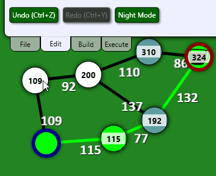
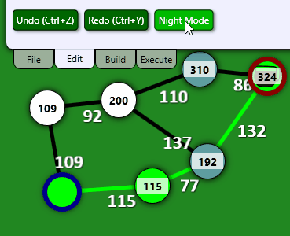

# Style and Animation
## Post Series
- [Introduction]( "Introduction")
- [UI Overview]( "UI Overview")
- [Commands and Undo]( "Commands and Undo")
- [Style and Animation]( "Style and Animation")

**[GitHub Source](https://github.com/Corey255A1/DijkstraCoffeeAndCode)**
With WPF you can use resources to define the styles of pretty much all the components of the GUI. Its a similar idea to CSS with HTML. You can create a resource file with different colors and brushes then swap between those and the elements update their colors automatically.

A pretty cool feature is how you can directly bind properties to trigger different states. For example the Node view.

```xml
 <Style.Triggers>
     <DataTrigger Binding="{Binding IsVisited}" Value="true">
         <Setter Property="Fill" Value="{StaticResource nodeVisitedColorBrush}"/>
     </DataTrigger>
     <DataTrigger Binding="{Binding IsHighlightedAlternate}" Value="true">
         <Setter Property="Fill" Value="{StaticResource highlightAltColorBrush}"/>
     </DataTrigger>
     <DataTrigger Binding="{Binding IsHighlighted}" Value="true">
         <Setter Property="Fill" Value="{StaticResource highlightColorBrush}"/>
     </DataTrigger>
     <DataTrigger Binding="{Binding IsSelected}" Value="true">
         <Setter Property="Fill" Value="{StaticResource selectedColorBrush}"/>
     </DataTrigger>
 </Style.Triggers>
```

The order of the triggers determines the precedence. In this case IsSelected is higher than the others. This allows you to just set a bool on the view model side and the view changes its color.

```xml
<Style TargetType="Rectangle" x:Key="thumb">
    <Setter Property="Fill" Value="Transparent"/>
    <Style.Triggers>
        <DataTrigger Binding="{Binding IsEndNode}" Value="true">
            <Setter Property="Fill" Value="{StaticResource ResourceKey=coffeePot}"/>
        </DataTrigger>
    </Style.Triggers>
</Style>
```

In that example, I'm setting the fill of a rectangle to the Coffee Pot SVG if it is the End Node. With that same property, I can set up another trigger
```xml
<DataTrigger Binding="{Binding IsEndNode}" Value="true">
    <DataTrigger.EnterActions>
        <BeginStoryboard>
            <Storyboard>
                <ColorAnimation To="{StaticResource endNodeColor}" Storyboard.TargetProperty="(Ellipse.Stroke).(SolidColorBrush.Color)" Duration="0:0:0.5"/>
            </Storyboard>
        </BeginStoryboard>
    </DataTrigger.EnterActions>
    <DataTrigger.ExitActions>
        <BeginStoryboard>
            <Storyboard>
                <ColorAnimation To="{x:Null}" Storyboard.TargetProperty="(Ellipse.Stroke).(SolidColorBrush.Color)" Duration="0:0:0.5"/>
            </Storyboard>
        </BeginStoryboard>
    </DataTrigger.ExitActions>
</DataTrigger>
```
This creates the glow effect when a node is set to the start or end of the graph. The Storyboard.TargetProperty is a little whacky looking but it works. The ColorAnimation is directly setting the Color of the brush of the stroke of the ellipse over the course of 0.5 seconds.
When the IsEndNode is cleared, the color transitions back to null.



# Resources
To handle the different color palettes for Day and Night modes, I created two different Resource files. In there I defined the same color names and solidcolorbrush names. However, I changed the colors of the brushes.

I wanted to just change a resource of colors, however it didn't seem to work dynamically which resulted in me redefining of of the styles in both.

For the Edge Highlight animation, I define a color and a brush based on that color. (In this case it doesn't use the brush).
Then the Storyboard I created with a key to use that color to transition between.
The DataTrigger then invokes that storyboard when the IsHighlighted is True.

```xml
<Color x:Key="highlightColor" G="125" A="255" />

<SolidColorBrush x:Key="highlightColorBrush" Color="{DynamicResource highlightColor}"/>

<Storyboard x:Key="edgeHighlightAnimation">
    <ColorAnimation To="{StaticResource highlightColor}" Storyboard.TargetProperty="(Line.Stroke).(SolidColorBrush.Color)" Duration="0:0:0.5"/>
</Storyboard>

<DataTrigger Binding="{Binding IsHighlighted}" Value="true">
    <DataTrigger.EnterActions>
        <BeginStoryboard Storyboard="{StaticResource edgeHighlightAnimation}">
        </BeginStoryboard>
    </DataTrigger.EnterActions>
    <DataTrigger.ExitActions>
        <BeginStoryboard>
            <Storyboard>
                <ColorAnimation To="{x:Null}" Storyboard.TargetProperty="(Line.Stroke).(SolidColorBrush.Color)" Duration="0:0:0.5"/>
            </Storyboard>
        </BeginStoryboard>
    </DataTrigger.ExitActions>
</DataTrigger>
```

And then the EdgeElement.xaml file uses that style like this. However notice it uses it as a DynamicResource instead of StaticResource. This is critical to getting it to update in realtime.
```xml
<Line Style="{DynamicResource highlightLine}" X1="{Binding X1}" Y1="{Binding Y1}" Y2="{Binding Y2}" X2="{Binding X2}"/>
```

## Swapping Resources
To Swap Resources between the DarkColors.xaml and DefaultColors.xaml is kind of clunky.
I created a Themes.cs class to store the themes and names.


```c#
public static class Themes
{
    public static readonly Dictionary<string, string> ColorSchemeMap = new() {
        { "Day Mode", "Resources/Themes/DefaultColors.xaml" },
        { "Night Mode", "Resources/Themes/DarkColors.xaml" }
    };

    public static readonly List<KeyValuePair<string, string>> ColorSchemeList = ColorSchemeMap.ToList();

    public static int GetCurrentThemeIndex(Collection<ResourceDictionary> resources)
    {
        ResourceDictionary? resource = resources.FirstOrDefault((dictionary) => { return ColorSchemeMap.Values.Contains(dictionary.Source.OriginalString); });
        if (resource == null) { throw new Exception("Theme not found in ColorSchemeMap"); }

        return ColorSchemeList.FindIndex(keyValue => keyValue.Value == resource.Source.OriginalString);
    }

    public static int GetNext(int index, out KeyValuePair<string, string> colorScheme)
    {
        index += 1;
        if (index < 0 || index >= ColorSchemeList.Count)
        {
            colorScheme = ColorSchemeList[0];
            return 0;
        }

        colorScheme = ColorSchemeList[index];
        return index;
    }
}
```

The trick to this is looking at the current Resource Dictionaries and remove the existing theme and add a new one. I didn't see any clean way to do this, so I use the FirstOrDefault comparing the Source names to the names in the Theme dictionary and if its found, remove it.

```c#
private void SetNewColorScheme(string colorFile, string previousColorFile)
{
    var dictionary = Application.Current.Resources.MergedDictionaries.FirstOrDefault(resource => resource.Source.OriginalString.Contains(previousColorFile));
    if (dictionary != null)
    {
        Application.Current.Resources.MergedDictionaries.Remove(dictionary);
    }
    ResourceDictionary newColorScheme = new();
    newColorScheme.Source = new Uri(colorFile, UriKind.Relative);
    Application.Current.Resources.MergedDictionaries.Add(newColorScheme);
}

public void MoveToNextColorScheme()
{
    KeyValuePair<string, string> currentStyle = Themes.ColorSchemeList[_currentStyleIndex];
    KeyValuePair<string, string> nextStyle;
    _currentStyleIndex = Themes.GetNext(_currentStyleIndex, out nextStyle);
    SetNewColorScheme(nextStyle.Value, currentStyle.Value);
    Themes.GetNext(_currentStyleIndex, out nextStyle);
    NextStyleName = nextStyle.Key;
}
```

As soon as the resource is swapped, the colors update to use those new styles.



I hoped you enjoyed this dive into implementing some various UI functions in WPF. This app is pretty much pointless but allowed me to practice implementing the core features of a modern UI.