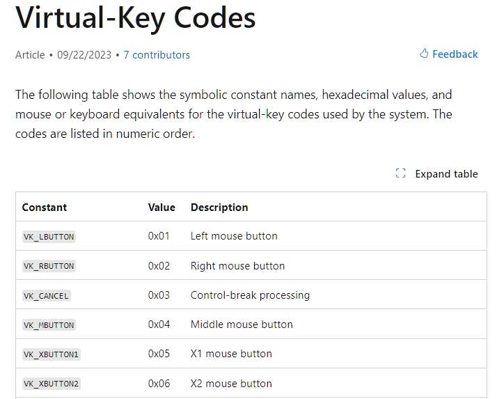
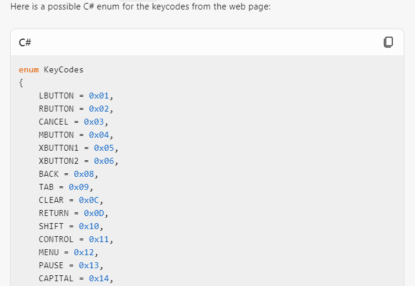
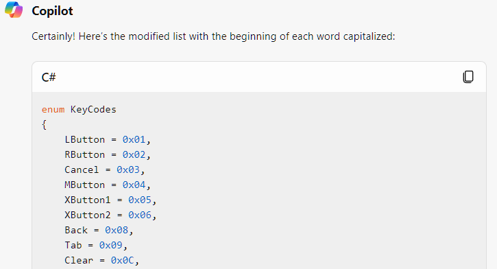
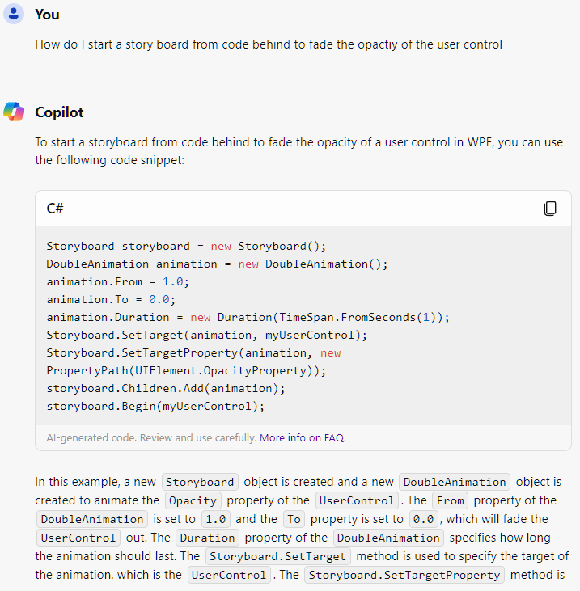

# Use of Bing CoPilot
I've been playing with the Bing Copilot to generate images and ask questions. For this, I decided to see how helpful it could be. It impressed me a lot.

I asked it grab the keycodes from:  
[https://learn.microsoft.com/en-us/windows/win32/inputdev/virtual-key-codes](https://learn.microsoft.com/en-us/windows/win32/inputdev/virtual-key-codes)

And format it in a C# enum with out the VK_ and it generated exactly that.

I then asked it to capitalize the beginning of each word.

This impressive feat saved me a ton of messing around with converting that VK table to a C# enum. That was crazy.

I then used it for other questions like the Storyboard to change the opacity,

I keep finding out more and more things that these AI assistance can do, and its getting more wild how well they work. I can't wait to continue to integrate these tools more into my workflow.