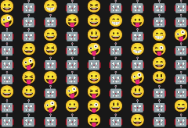

# Introduction
**[GitHub Source](https://github.com/Corey255A1/SudokuSolverCpp)**

I needed to get in the mind set of writing more modern C++ code. I thought that a Sudoku solver
would be the perfect challenge that can be easily executed from the command line. While writing
out the code, I decided that I needed something that would make this project unique. Reading and solving
a Sudoku board made of emojis seemed like a unique enough twist. Emojis and the console still aren't
the best of friends, but it worked out! I also made it general enough to solve any size of board.

<div class="embed-youtube">
<iframe width="100%" height="100%" src="https://www.youtube.com/embed/dBd1zxTT5Vo?si=aPRbkyiDReTSSnMu" frameborder="0" allow="accelerometer; autoplay; clipboard-write; encrypted-media; gyroscope; picture-in-picture" allowfullscreen></iframe>
</div>

# Backtrack
The backtrack algorithm is easy to understand. For each cell, find the next valid value and move to the next cell. If the cell can't be populated, go back a cell and try the next value and continue. This could easily be done with an array and a couple of loops. However, I opted to make things more complicated. Normally, this could be done by just incrementing the cell value and checking if it is valid and then continuing. I took the approach of gathering all the valid values for that cell, and then getting the next highest valid value. If there are no more, then backtrack.



Here is the concept that I went with in pseudo code.
```
Initialize currentRow = 0
Initialize currentColumn = 0

While currentRow < boardSize:
    If currentColumn < boardSize:
        Get the cell at (currentColumn, currentRow)
        If the cell is read-only:
            Increment currentColumn
            Continue
        Get valid values for the cell
        If no valid values:
            Backtrack
            Continue
        If the cell is already set:
            Get the next valid value (if available)
            If no next valid value:
                Backtrack
                Continue
            Else:
                Set the cell value to the next valid value
        Else the cell has the default value:
            Set the cell value to the first valid value
        Increment currentColumn
    Else go to the start of next row:
        Reset currentColumn to 0
        Increment currentRow
```
# Quick Code Overview
- **SudokuBoard** this contains a vector of SudokuCells. It contains methods to set cell values and retrieve the valid values for a cell
- **SudokuCell** A SudokuCell basically can be set as readonly to prevent the algorithm from altering it. Its value is a SudokuValue.
- **SudokuValue** is a base class for the SudokuValueInt and SudokuValueEmoji. This makes the board agnostic to the underlying value types or ranges
- **SudokuValueRange** The Value Range, defines what possible values that SudokuValue can have. It also serves as a factory to create or grab values.
- **SudokuBacktrack** is the class the implements the backtrack algorithm and operates on the board. I split the solve loop into the take step method so that it is easier to visualize each step.
- **SudokuFileReader** parse the Sudoku File and potential headers and creates an appropriate value range and board.

# Sudoku Value
When I first started, I focused on completing the main idea which was to read in at least a 9x9 grid and solve the standard Sudoku board. As I was looking at this code in the getValidValues:
```c++
std::set<int> validValues;
for (int value = 1; value <= m_size; value++) { validValues.insert(value); }

auto cell = getCell(column, row);
if (cell.isValid())
{ 
    auto valueIterator = validValues.find(cell.value());
    if (valueIterator != validValues.end())
    { 
        validValues.erase(valueIterator);
    }
}
```

I was realizing that the validValues didn't have to be ints, and could just be a range of some class. While thinking about how I could take a boring a Sudoku solver to the next level, I imagined a range of emojis.

Eventually this:
```c++
std::set<int> validValues;
for (int value = 1; value <= m_size; value++) { validValues.insert(value); }
```
Became this:
```c++
auto validValues = m_valueRange->getValueSet();
```

To do this, I created an abstract base class SudokuValue which defines some comparison methods and some stream outputs. A Value can be a value within the min and max of the value range (like 1 to 9) or can be the default value which is a value outside that range (like 0 or -1, or 10)

```c++
virtual size_t getHash() const = 0;
virtual bool equals(const SudokuValue *right) const = 0;
virtual bool lessThan(const SudokuValue *right) const = 0;
virtual bool lessThanOrEqual(const SudokuValue *right) const = 0;
virtual std::unique_ptr<SudokuValue> makeCopy() const = 0;
virtual std::ostream &outToStream(std::ostream &stream) const = 0;
virtual std::wostream &outToStream(std::wostream &stream) const = 0;
std::shared_ptr<const SudokuValueRange> getValueRange() const;
bool isDefault() const;
```

The comparisons are then defined in the subclasses to compare the values appropriately

```c++

bool SudokuValueInt::equals(const SudokuValue *right) const
{
	return m_value == castTo(right)->m_value;
}

bool SudokuValueInt::lessThan(const SudokuValue *right) const
{
	return m_value < castTo(right)->m_value;
}

bool SudokuValueInt::lessThanOrEqual(const SudokuValue *right) const
{
	return m_value <= castTo(right)->m_value;
}
```

Each value has a shared pointer to its ValueRange. The ValueRange defines how the values are ordered.

# Value Range
The SudokuValueRange is an abstract base that contains the possible values and creates the shared pointers for all the values in that range. As an example, the *getNext* and *getPrevious* abstract methods
```c++
virtual std::shared_ptr<SudokuValue> getNext(const SudokuValue *value) const = 0;
virtual std::shared_ptr<SudokuValue> getPrevious(const SudokuValue *value) const = 0;
```

Are defined like this in the Emoji Range.
```c++
std::shared_ptr<SudokuValue> SudokuValueEmojiRange::getNext(const SudokuValue *value) const
{
	return getValue(SudokuValueEmoji::castTo(value)->getValue() + 1);
}

std::shared_ptr<SudokuValue> SudokuValueEmojiRange::getPrevious(const SudokuValue *value) const
{
	return getValue(SudokuValueEmoji::castTo(value)->getValue() - 1);
}

std::shared_ptr<SudokuValue> SudokuValueEmojiRange::getValue(int index) const
{
	if (index > m_count || index == m_invalid)
	{
		return m_values.at(m_invalid);
	}
	return m_values.at(index);
}
```

# Shared From This
Because of the code structure that I defined, the values that are created and stored with in the range need to contain a shared pointer to a range. Originally, I thought about just passing a reference to the value, but I got worried about the lifetime of that reference (even though for this project there is no worry).

How do you get a shared_ptr to the class that you are in? Turns out that you can derive your class from **std::enable_shared_from_this<T>**

```c++
#include <memory>
class SudokuValueRange : public std::enable_shared_from_this<SudokuValueRange>
{
};
```

What this allows you to do is call the **shared_from_this()**:
```c++
for (int i = 1; i < emojis.size(); i++)
{
    m_values[i] = std::make_shared<SudokuValueEmoji>(shared_from_this(), i, emojis[i]);
    m_valueSet.insert(m_values[i]);
}
```
And does exactly what you expect it to do!


# Smart Pointers and Set/Map
Another interesting case I ran into was; how to create a Set or Map while using smart pointers?

Naively, you could just set up your set like these
```c++
std::set<std::shared_ptr<SudokuValue>>
std::unordered_set<std::shared_ptr<SudokuValue>>
```
The problem though, is that they are not using the actual underlying value. So looking for a shared_ptr to the number 4 with a different shared_ptr to the 4 won't actually check if the number 4 is in the set. The shared_ptrs are two different objects. This is clearly not the intention.

The way to do this is to define your own custom comparison classes, and set those other default template slots with your comparison.

```c++
std::unordered_set<std::shared_ptr<SudokuValue>, SudokuValueOps, SudokuValueOps>

std::set<std::shared_ptr<SudokuValue>, SudokuValueLT>
```

This defines the two operators to retrieve the hash and compare the actual Sudoku value classes. This is required for the std::unordered_set
```c++
struct SudokuValueOps
{
	size_t operator()(const std::shared_ptr<SudokuValue> &value) const
	{
		return value->getHash();
	}

	bool operator()(const std::shared_ptr<SudokuValue> &left, const std::shared_ptr<SudokuValue> &right) const
	{
		return left->equals(right.get());
	}
};
```

This defines the Less Than operators which is required for the std::set
```c++
struct SudokuValueLT
{
	bool operator()(const std::shared_ptr<SudokuValue> &left, const std::shared_ptr<SudokuValue> &right) const
	{
		return left->lessThan(right.get());
	}
	bool operator()(const std::shared_ptr<SudokuValue> &left, const SudokuValue *right) const
	{
		return left->lessThan(right);
	}
	bool operator()(const SudokuValue *left, const std::shared_ptr<SudokuValue> &right) const
	{
		return left->lessThan(right.get());
	}
};
```

# Unicode
Handling unicode in C++ is not really intuitive and dependent on the OS and terminal that you are using. I made use of all the things like **std::wcout** and **std::wstring** but there are still some got ya's.

For Linux to behave, make sure you set your locale to the default machine locale.

```c++
std::setlocale(LC_ALL, "");
```

For Windows, you have to set your terminal to U16 Mode, however the old classic Command line does not support unicode. You have to use the new Windows Terminal. However, at this time, there seems to be a few bugs in it still
```c++
_setmode(_fileno(stdout), _O_U16TEXT);
```

To read from a UTF8 file, first the file it self has to be marked as UTF8. Then for Windows, you have to create a std::locale object that converter for UTF8 to UTF16 which maps to the wchar_t. For Linux you can just map UTF8 to the wchar_t.

The wifstream is then code how to treat the byte stream. Ensure that you open the stream as binary so that it doesn't get tripped up trying to text read it.

```c++
#ifdef _WINDOWS
	std::locale utf8Locale = std::locale(std::locale(), new std::codecvt_utf8_utf16<wchar_t>());
#else
	std::locale utf8Locale = std::locale(std::locale(), new std::codecvt_utf8<wchar_t>());
#endif

	std::wifstream sudokuFile(filePath, std::ios::binary);
	sudokuFile.imbue(utf8Locale);
	if (!sudokuFile.is_open())
	{
		throw std::runtime_error("Sudoku File could not be opened");
	}
```

It took a little bit of searching and trial to figure out how to get this to work, but it still doesn't seem as robust as other languages support for unicode.

# File Reader
For the file reader, I came up with a basic header.   
**U** followed be space separated unicode characters (or multiple characters) are defined to be the range of values for the board, and it uses the Emoji processor.  
**B** followed by some dimensions, defines the box size of the board. This was needed for board sizes like 12, which the box is not square (4x3).  
If neither of these headers are found, it just goes to number mode and assumes the board is a number range 1 to line size and that the boxes are square.

Emoji Board
```
U🤖 😀 😃 😄 😁 😆 😛 😝 😜 🤪
🤖 🤖 😁 🤖 😆 🤖 🤖 🤖 🤖
🤪 🤖 🤖 😝 😄 😁 😛 🤖 🤖
🤖 🤖 😄 🤖 😃 😀 🤖 😁 🤪
🤖 😄 😆 🤖 🤪 🤖 😁 😜 🤖
🤖 🤪 🤖 🤖 🤖 🤖 🤖 😄 🤖
🤖 😝 😛 🤖 😀 🤖 🤪 😃 🤖
😄 😀 🤖 🤪 😝 🤖 😃 🤖 🤖
🤖 🤖 🤪 😀 😜 😃 🤖 🤖 😄
🤖 🤖 🤖 🤖 😛 🤖 😀 🤖 🤖
```

12 with AlphaNumeric characters, treated as emoji board
```
Ux 1 2 3 4 5 6 7 8 9 A B C
B4 3
x B x x C 5 3 1 8 x 6 x
x x 7 C 6 9 x x x x x B
x x 1 x x x 8 x x 9 x 5
6 7 x x x x 5 C x x 3 x
x x 4 3 x 2 6 8 x 5 9 x
x x x x x A 1 x x x 8 x
x A B x x x 9 2 3 8 7 x
x x C x x 4 A x x 6 5 1
x 8 x x x 3 C x A B 2 x
B C x 2 x x x x x 7 x 9
x x 8 1 x x x x 5 x 4 x
A 6 x x x x x x x 2 x x
```

# Timing
The point of the exercise was not to create the fastest sudoku algorithm but to explore different concepts within in C++. However, timing things is always fun. To time the boards, I'm using the **<chrono>** header with the **auto startTime = std::chrono::high_resolution_clock::now();**.
```c++
auto startTime = std::chrono::high_resolution_clock::now();
if (!backTrack.solve(verboseOutput))
{
    std::wcout << L"Sudoku Board could not be solved" << std::endl;
}
auto endTime = std::chrono::high_resolution_clock::now();
auto duration = std::chrono::duration_cast<std::chrono::microseconds>(endTime - startTime);
double seconds = static_cast<double>(duration.count()) / 1000000.0;
std::wcout << std::endl
            << L"-- Solution Found in " << seconds << L"s!! --" << std::endl;
```

My desktop is running a Intel I5-6500.
## As the code is now:
- To solve the base -- mostly in the **0.0006s**!
- The emoji test is same as the base test and takes about the same about of time.
- To solve the "hard" -- mostly in the mid **0.03s** range
- To solve the "hardest" -- mostly just under **0.16s**
- To solve the 12 board: -- mostly in the **0.015s**

Not too far off from the original int only solver.

## At commit "Working Solver"
The first commit I pushed that declared this a working solver
- To solve the base -- mostly in the **0.0005s** range
- To solve the "hard" -- mostly in the **0.03s** range
- To solve the "hardest" -- mostly in the **0.13s** range

This was faster than the current implementation not too much.


## At commit "Fully Generic SudokuValue.. for better or worse"
Here I had things mostly working but was using unique pointers and doing a lot of copying around.
- To solve the base -- mostly in the **0.002s** range
- To solve the "hard" -- mostly in the **0.13s** range
- To solve the "hardest" -- just under **0.6s**!!

This was by far the least efficient version. This shows how expensive making copies of objects can be. I'm glad I pivoted to the shared pointer version.


# Conclusion
Even though I wasn't going for efficiency, this project allowed me to brush up on using polymorphism, smart pointers and compare how different techniques can impact performance. I also got to dive into the unicode world and make something that isn't just boring old ascii. Overall, this was a fun way to explore different topics in C++ and go outside the realm of a typical Sudoku Solver. 